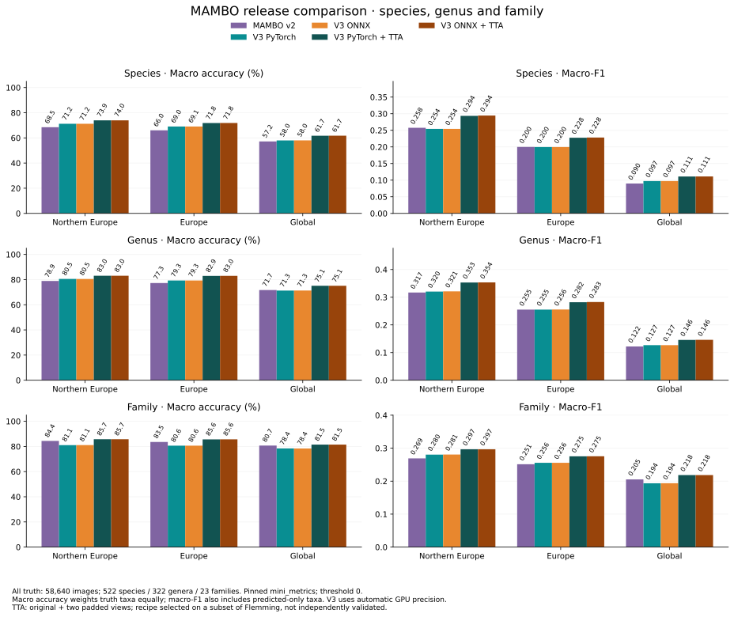
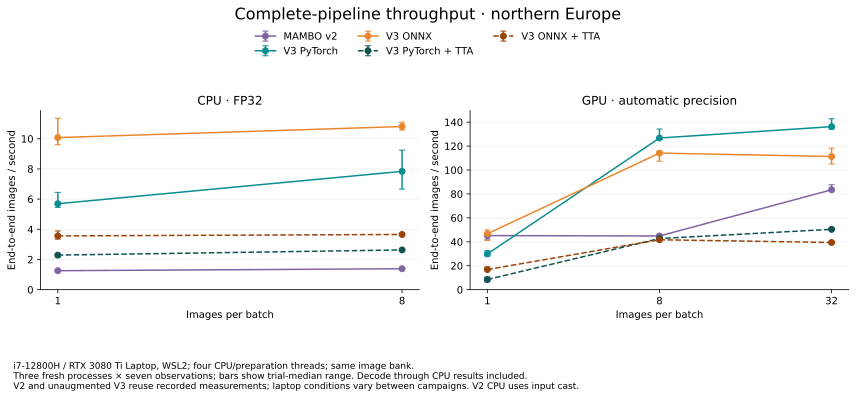

# MAMBO deployment — release candidate

Use a local model bundle with native PyTorch or standard ONNX. Inference needs no
network, taxonomy service, administrator permissions or writable model directory.
The runtime is separate from the model files; keep each ONNX graph beside its
`model.onnx.data` file. This candidate has not been publicly released.

## Quick start

Install the supplied `mambo_deploy` wheel with the `onnx` extra for CPU inference.
For example, in a virtual environment:

```sh
pip install './mambo_deploy-0.3.0-py3-none-any.whl[onnx]'
```

```python
from mambo_deploy import Predictor

predictor = Predictor(bundle="/path/to/mambo-bundle", backend="onnx", device="cpu", model="europe")
result = predictor.predict("moth.jpg")
print(result[0].label)       # species, genus, family IDs
print(result[0].confidence)  # conditional probabilities for those ranks
result, embeddings = predictor.predict_with_embeddings(["moth.jpg"])
```

Choose a preset using `model`, inspect `predictor.available_presets()`, or replace
it with `class_list=["GBIF_SPECIES_ID", ...]` (also accepts a UTF-8 filename).
Unknown IDs and empty lists are errors; duplicates are removed and model ordering
is preserved. Filtering happens before ranking and hierarchy normalization.
See PRESETS.md in the bundle for short geographic scopes and provisional cutoffs.
Use `europe_v3` or `north_europe_v3` for updated lists requiring at least 3 regional
and 25 global records. `europe` (the default) and `north_europe` retain their legacy
membership. The updated versions use the same explicit geographic filters.
Presets retain species with qualifying occurrence records; they are practical
prediction filters, not maps of native distributions or exhaustive checklists.

Inputs are paths, PIL images, CHW/BCHW NumPy arrays or tensors. Arrays must be
uint8 or floats in [0,1]; transpose HWC arrays explicitly. Images are decoded RGB
without EXIF rotation, alpha is discarded, then the recorded campaign resize,
crop and normalization recipe is applied. Both backends use the same CPU image
preparation. `batch_size=8` bounds model batches; returned results remain in memory.

## PyTorch and GPU

For native inference, install the matching `mini_trainer` wheel with your chosen
PyTorch/CUDA build and use `backend="torch"`. The checkpoint is loaded with
`weights_only=True`; the architecture is constructed without pretrained downloads.
CUDA PyTorch defaults to FP16 backbone autocast with an FP32 classifier and
FP32 outputs. Set `precision="fp32"` to disable autocast, or
`precision="bf16"` on CUDA devices with native BF16 support. Native inference
respects the caller's PyTorch TF32 backend flags; reference benchmarks disable them.
For ONNX CUDA, install `onnxruntime-gpu` instead of the CPU ONNX Runtime package,
with its matching CUDA/cuDNN dependencies. Select `device="cuda:0"` explicitly.
Unavailable CUDA raises an error rather than silently changing to CPU-only
execution. ONNX CUDA may still place individual unsupported operators on CPU. Its automatic
precision enables TF32 using the standard FP32 graph; `precision="fp32"` disables
TF32. ONNX FP16/BF16 is not selected by PyTorch autocast. CPU always uses FP32.
The resolved choice is available as `predictor.effective_precision` and in result
metadata; the CLI exposes the same `--precision` option.

Portable results use NumPy arrays; embeddings are float32 `[images, 1280]` CPU
arrays from the normalized preclassification stage. Prediction-only ONNX uses
the original graph; requesting embeddings selects the existing embedding graph.
Without TTA, each image uses one backbone pass. `topk` ranks each hierarchy level independently;
a tuple is not necessarily an ancestral path. `indices` refer to the filtered
rank vocabulary; `global_indices` refer to the full model vocabulary.

## Existing MAMBO callers

The matching training wheel restores `mini_trainer.deploy.Predictor`, with native
PyTorch and CUDA defaults, Europe as the default preset, callable/predict methods,
`class_mask` (including `-1` reset) and `(predictions, embeddings)` output. Install
the deployment wheel too and set `MAMBO_BUNDLE`, or pass `bundle=` explicitly.
Native compatibility results use the existing hierarchical prediction container
and device tensors. The portable API defaults to ONNX/CPU; choose it for new code.

Migration limits: inference no longer implicitly downloads a model; pass a local
bundle. Local `weights=` overrides must match this release checkpoint; arbitrary
legacy BioCLIP weights/state dictionaries are not supported by this release adapter.
Legacy pins remain the way to run those models. Embedding dimensions change with
the backbone. Legacy top-k serialization defects are not a portable API guarantee.
New portable preprocessing always applies the documented recipe to array inputs;
old callers that supplied already-resized or preprocessed tensors should review it.

## Command line

```sh
mambo_predict -i moth.jpg --bundle /path/to/mambo-bundle --backend onnx --device cpu -M europe -o . --name results
```

Directory input recursively discovers images in sorted order. Outputs are
`predictions.json` and `mini_metric.csv`; `--embeddings` also writes `embeddings.npy`.
Use `--class-list`, `--batch-size`, `--topk` and `--threads` as needed. `--threads`
bounds parallel image preparation and controls ONNX CPU threads; native callers
configure PyTorch model threads separately. Use `--preprocess-workers 1` for serial preparation. The standalone
wheel defaults to ONNX/CPU; the training-wheel entry point retains native/CUDA
defaults, so explicit backend/device arguments are recommended in scripts.

## Optional test-time augmentation

TTA is off by default. Simply enable it to use the recommended recipe:

```python
predictor = Predictor(bundle, backend="onnx", model="north_europe", tta=True)
# CLI: append --tta
```

This selects `padded_scale`: the original plus views with 8% and 15% edge padding.
It had the highest exploratory macro accuracy and lower cost than D4 or padded
rotations. Set `tta="padded_scale"` to pin the recipe explicitly; `tta=False` or
`--tta none` disables it. Result metadata records the resolved recipe and view count.

Views use ordinary preprocessing and the chosen backend. Species logits are
averaged before preset filtering and hierarchy reduction; embeddings are the
normalized mean of view embeddings. Each model call stays within `batch_size`.
The [TTA guide](../docs/mambo-tta.md) documents costs, explicit alternative recipes
and custom image transforms through the same outer interface.

## Release comparison

Results below use all **58,640 Flemming images / 522 truth species**, including
species outside the selected vocabulary. All predictive metrics use pinned
`mini_metrics`, threshold zero and no threshold optimization. The main table uses
the recommended northern-Europe legacy list (`north_europe`), shared by V2 and V3.
TTA means the enabled padded-scale default. V3 quality uses automatic GPU precision;
CPU timings use FP32.

| Pipeline | Species macro accuracy | Species macro-F1 | CPU B1 | GPU B1 | GPU B8 | GPU B32 |
|---|---:|---:|---:|---:|---:|---:|
| MAMBO v2 | 68.52% | 0.2575 | 1.26 | 45.2 | 44.8 | 83.5 |
| V3 PyTorch | 71.25% | 0.2543 | 5.70 | 29.8 | 126.7 | 136.2 |
| V3 ONNX | 71.24% | 0.2543 | 10.08 | 46.7 | 114.1 | 111.3 |
| V3 PyTorch + TTA | 73.95% | 0.2935 | 2.29 | 8.5 | 42.7 | 50.4 |
| V3 ONNX + TTA | 73.98% | 0.2944 | 3.56 | 16.8 | 41.7 | 39.4 |

Speed is **images per second**, including decoding through completed CPU results,
on an i7-12800H / RTX 3080 Ti Laptop. Three fresh-process trials use the same image
bank and four preparation/runtime CPU threads; V2 and ordinary V3 reuse retained
measurements. V2 CPU uses its documented float32 input adapter.

Northern Europe, **genus and family**, also all truth and threshold zero:

| Pipeline | Genus macro accuracy / F1 | Family macro accuracy / F1 |
|---|---:|---:|
| MAMBO v2 | 78.90% / 0.3169 | 84.40% / 0.2691 |
| V3 PyTorch | 80.53% / 0.3204 | 81.05% / 0.2804 |
| V3 ONNX | 80.50% / 0.3212 | 81.06% / 0.2808 |
| V3 PyTorch + TTA | 83.04% / 0.3532 | 85.72% / 0.2967 |
| V3 ONNX + TTA | 83.04% / 0.3536 | 85.73% / 0.2967 |

Ordinary V3 improves genus macro accuracy but reduces family macro accuracy
versus V2 (84.40% → about 81.05%). TTA raises these to about **83.04% genus /
85.72–85.73% family**, exceeding V2 at both ranks.



Regional filtering improves results on Flemming. The [single regional-effect figure](../docs/mambo-deployment-defaults.md#regional-filtering-effect)
summarizes global → Europe → northern Europe across pipelines and ranks.
We recommend legacy `north_europe` here: the updated list adds 222 species but
no Flemming species coverage, and lowers measured accuracy/F1. It remains available
as `north_europe_v3` for broader eligibility; the API default stays `europe`.



The [full comparison](../docs/mambo-deployment-defaults.md) includes memory charts,
all/known-truth metrics at every rank, updated European presets and reproducible
commands. The [frequency curves](../docs/mambo-frequency-comparison.md) compare
training and Flemming support. The [loading study](../docs/mambo-loading-scaling.md)
explains remaining scheduling limits; `preprocess_workers` / `--preprocess-workers`
tunes preparation separately from ONNX runtime `threads` and defaults to it.

Confidence rejection is a separate trade-off. The [threshold study](../docs/mambo-confidence-thresholds.md)
compares all five pipelines with Macro-F1-optimized thresholds, coverage and P–R
curves at every rank. V3 + TTA leads calibrated species/genus Macro-F1, while V2
leads family Macro-F1; selected operating points accept roughly 70–79% of images.
Threshold-zero defaults remain unchanged.

Use ordinary V3 for throughput and enable TTA when its accuracy/cost trade-off fits.
The recipe was selected on a Flemming subset, so full-set results are descriptive,
not independent validation. In-domain UCloud evaluation, other operating systems,
and publication/license review remain open. See the [evaluation workflow](../dev/releases/mambo_v3/evaluation.md).
