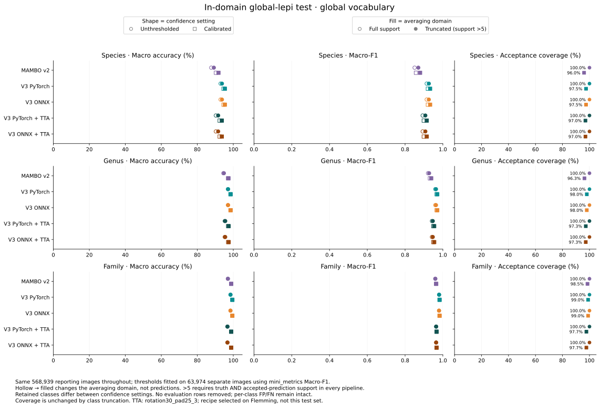
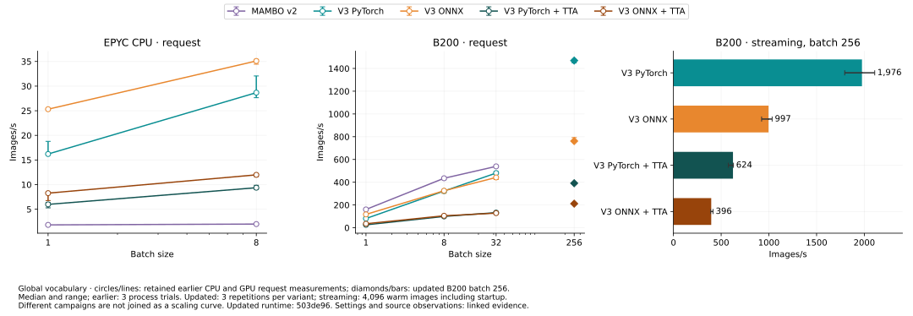

# MAMBO deployment — release candidate

Identify moths and butterflies from images, with species, genus and family
predictions. V3 adds a standalone ONNX option alongside PyTorch: **no training
package or GPU is needed for ONNX/CPU**. Both backends use the same API, regional
lists and output format. The comparisons below show quality and speed against V2,
including CPU, laptop GPU and server GPU measurements.

This candidate is not yet published; the examples use the supplied release wheels.
Model files download automatically from public ERDA storage on first use and are
verified and cached. Reuse one predictor across calls.

## Quick start

Create an environment, or use your application's existing environment. Python 3.12+
is required. Install ONNX/CPU to start without a CUDA setup:

```sh
uv venv --python 3.13 .venv
source .venv/bin/activate  # Windows PowerShell: .venv\Scripts\Activate.ps1
uv pip install './mambo_deploy-0.3.0-py3-none-any.whl[onnx]'
```

**Python** — choose the region where your images were collected:

```python
from mambo_deploy import Predictor

predictor = Predictor(model="north_europe")  # ONNX, CPU; use "full" for global
result = predictor.predict(["moth.jpg", "butterfly.jpg"])
print(result[0].label)       # (species_id, genus_id, family_id)
print(result[0].confidence)  # confidence for each of those ranks
records = result.to_dict()   # list of JSON-serializable records for your application
```

**CLI** — the same defaults, for files or a directory:

```sh
mambo_predict -i ./images --model north_europe -o ./output --name predictions
```

This creates `output/predictions/predictions.json` and `mini_metric.csv`;
`--embeddings` also writes `embeddings.npy`. Choose a new output name for each run.
For a one-off command without installing into your application environment, replace
`mambo_predict` with
`uvx --from './mambo_deploy-0.3.0-py3-none-any.whl[onnx]' mambo_predict`.

| Interface | Inputs | Outputs |
|---|---|---|
| Python `predict(images)` | A path, PIL image, CHW array/tensor, or collection of these; BCHW batches also work. Original pixels: uint8 or floats in [0,1]. | One result per image, in input order. `label`, `confidence`, `index` have species/genus/family order; labels are GBIF taxon IDs as strings. `to_dict()` produces ordinary Python records; `save(path)` writes JSON. |
| Python `predict_with_embeddings(images)` | Same inputs. | `(result, vectors)`; vectors are a float32 NumPy array `[N,1280]` with unit-length rows. |
| CLI `-i` | One or more image files or directories, searched recursively. | JSON contains `results`, `metadata` and `config`; each result has `label`, `confidence`, `index`. CSV has one row per image/rank for evaluation. |

For an RGB HWC NumPy image, pass `image.transpose(2, 0, 1)`; convert OpenCV BGR to
RGB first. Do not resize or normalize images yourself. Alpha is discarded and EXIF
orientation is not applied. Predictions at each rank are independent, so the three
IDs need not form one ancestral path. CSV truth labels are inferred from parent
folder names; arbitrary image folders do not supply evaluation ground truth.

## Choose the configuration that matters

**Choose a geographic scope; leave the other defaults initially.** ONNX/CPU is the
simplest dependency footprint and a useful starting point for CPU-only and edge
applications. For NVIDIA GPU throughput, use PyTorch if it fits your environment,
or ONNX/CUDA to keep the training package out of your application.
[Runtime installation and offline use](../docs/mambo-integration.md) covers these
alternatives. Changing runtime does not change the input/output contract.

**Enable `tta=True` / `--tta` for monitoring images when the quality gain below is
worth roughly 3× lower throughput.** Keep the default recipe. Its benefit is
image-domain dependent; the general-photograph comparison below provides context.

Keep `precision="auto"`. Increase `batch_size` only when processing enough images
to benefit; reduce it if memory is tight. Adjust CPU workers only if needed to meet
your application's throughput or CPU budget. Request embeddings or extra candidates
only when your workflow uses them. No server, dataset metadata or training setup is
required.

Pass API settings to `Predictor(...)`, except the prediction methods shown below.
CLI flags apply to `mambo_predict`.

| Python API | CLI | Default | Role / main trade-off |
|---|---|---|---|
| `model=`, `class_list=` | `--model`, `--class-list` | `europe` / no override | Eligible species; affects predictions and confidence. |
| `backend=`, `device=` | `--backend`, `--device` | `onnx`, `cpu` | Runtime and hardware: `onnx` or `torch`; `cpu` or `cuda:0`. |
| `tta=True` | `--tta` | Off | Quality versus throughput; enabling uses the recommended three-view recipe. |
| `batch_size=` | `--batch-size` | `8` | Images per model call: throughput versus memory. |
| `threads=` | `--threads` | `2` | ONNX CPU threads and default image-preparation workers; does not set PyTorch's model threads. |
| `preprocess_workers=` | `--preprocess-workers` | Follows `threads` | Image-preparation CPU allocation. |
| `precision=` | `--precision` | `auto` | Runtime-selected compute precision; normally leave unchanged. |
| `predict_with_embeddings(images)` | `--embeddings` | Off | Vectors for similarity/search or downstream features. |
| `predict(images, topk=k)` | `--topk k` | `1` | Candidates per rank; Python returns a list of candidates per image when `k > 1`. |
| CLI only | `--threshold` | `0` | Acceptance flag in the evaluation CSV; JSON predictions stay unfiltered. |

### Geographic scope

Use `predictor.available_presets()` to list choices, or read the
[preset catalogue](../docs/model-presets.md) for their exact scope and construction.
Presets include species that **can occur** in a region, including introduced
species; they are neither native-distribution maps nor exhaustive checklists.
Use `model="full"` if a regional restriction is inappropriate.

`europe` and `north_europe` preserve the V2 lists. Updated `_v3` lists are also
available; legacy `north_europe` performed better on Flemming and is recommended
for comparable northern-European use. A custom `class_list=["GBIF_SPECIES_ID", ...]`
or UTF-8 file with one ID per line overrides the preset (`--class-list species.txt`
in the CLI). Unknown IDs and empty lists fail; duplicates are removed.

### Integrating with V2 applications

The `mini_trainer.deploy.Predictor` compatibility entry point retains native/CUDA
defaults, callable prediction, `class_mask` and native result containers. It needs
both release wheels. New integrations can use the smaller `mambo_deploy` interface
above, with CPU results independent of backend. Both download model assets automatically.

Retain the legacy regional preset for comparison, and match species by taxon ID,
not numeric index. The V3 vocabulary, scores and embedding width can differ from V2;
existing thresholds and stored embeddings are not interchangeable.
[Migration details](../docs/mambo-integration.md#moving-from-v2) describe the remaining
compatibility boundaries.

### Large image collections

Use streaming for a large collection of paths, consuming results as they arrive:

```python
from contextlib import closing

with closing(predictor.predict_stream(image_paths)) as batches:
    for result in batches:
        records = result.to_dict()
        # Write records to your database, file or downstream service here.
```

Input order is preserved. Add `embeddings=True` to receive `(result, vectors)` pairs.
For in-memory inputs, split large collections into smaller `predict()` requests;
that method and the CLI retain results for the whole request. `batch_size` limits
model calls, not total request memory. [Streaming controls](../docs/mambo-integration.md#streaming-controls)
are available if the defaults do not fit your workload.

## Release comparison

These results help choose TTA and runtime; they do not establish accuracy in every
region. All models use legacy northern Europe on the same 52,788 Flemming reporting
images, including out-of-vocabulary truth. `mini_metrics` selects calibrated
thresholds per pipeline/rank on 5,852 separate images. Recipe exploration used
Flemming too, so this is descriptive evidence, not independent validation.

The quality figure compares **unthresholded and calibrated predictions**, with
full-support and support >5 macro metrics alongside acceptance coverage. TTA uses
`rotation30_pad25_3`; its quality gain comes at the throughput cost shown below.


Support >5 requires more than five truth instances and accepted predictions in
every compared pipeline. Truth classes outside that average account for
15.30% / 0.42% / 0.01% of images at species/genus/family without thresholds,
and 18.95% / 11.21% / 0.03% after calibration. No evaluation rows are discarded;
the averaging class sets differ between confidence settings. Full-support metrics
retain rare and predicted-only classes, which can change model rankings.

Measured **images/second**, end to end, on an i7-12800H / RTX 3080 Ti Laptop with
four preparation/runtime threads. V3 uses automatic precision; compare on your own
hardware before choosing a batch size. These laptop measurements predate the latest
pipeline improvements and remain a consumer-hardware baseline.


On this laptop, ONNX is faster on CPU; native PyTorch benefits more from larger
GPU batches. TTA improves quality but reduces throughput, so enable it according
to your accuracy and processing-budget requirements.

The [complete evidence reference](../docs/mambo-deployment-evidence.md) retains
exact metric tables, calibrated thresholds, timing ranges and limitations.
### Complementary in-domain and HPC results

The original global-lepi test split adds a comparison on general photographs using
the global vocabulary. It complements Flemming's deployment-relevant monitoring
crops; the image domains and class lists differ, so their absolute scores should
not be compared as a controlled domain-effect estimate. The same `mini_metrics`
calibration/support policy uses 568,939 reporting images and 63,974 separate
calibration images, with both confidence settings evaluated on the reporting split.



V3 improves in-domain performance over V2. The Flemming-selected TTA recipe reduces
in-domain performance, illustrating that its benefit depends on the input domain;
this does not override its benefit on the more deployment-relevant Flemming crops.
Support >5 changes the class average, not the evaluation rows. Truth classes outside
that average represent 1.70% / 0.34% / <0.01% of species/genus/family images without
thresholds, and 1.88% / 0.38% / <0.01% after calibration. Thresholds and complete
metrics are in the [in-domain evidence](../docs/mambo-indomain-evidence.md).



The server comparison retains CPU, GPU request and GPU streaming throughput in
**images/second**. B200 batch-256 values are updated: PyTorch reaches **1,976 images/s**
and ONNX **997 images/s** when streaming, or **624 and 396** with TTA. CPU, V2 and
smaller-batch results retain their earlier measurements; new request points are
shown separately rather than joined to older scaling curves. These are measured
application rates, not a promise of GPU saturation.

[Timing details and provenance](../docs/mambo-hpc-evidence.md) record measurement
settings, memory and repeat ranges. Keep the laptop comparison above when choosing
for consumer devices. ONNX's CPU advantage and independence from the training
package make it especially relevant when a GPU or the full PyTorch stack is not
an option; PyTorch remains the faster GPU choice in these measurements.
