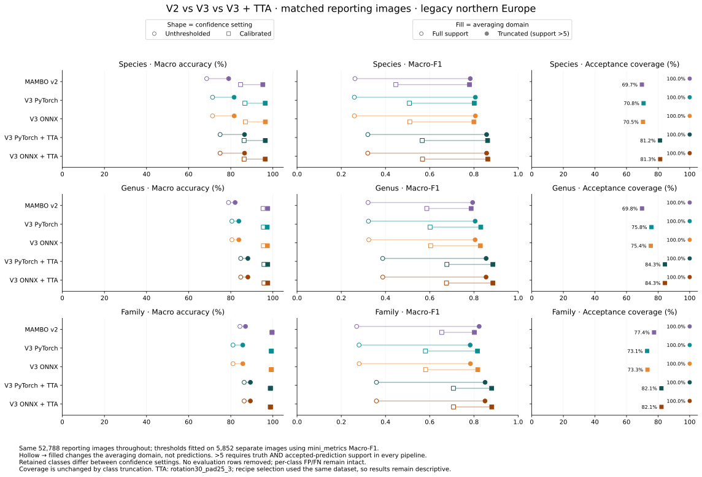
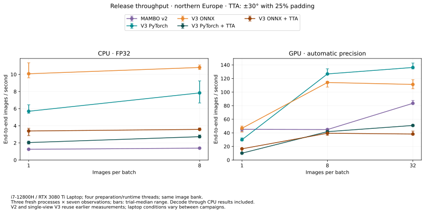

# MAMBO deployment — release candidate

Run MAMBO with ONNX or PyTorch, on CPU or NVIDIA CUDA. Required model files
download automatically from public ERDA storage on first use and are verified
before caching. This candidate has not been publicly released; use the supplied wheel.

## Quick start

Start with ONNX/CPU for the smallest installation: it needs no training package.
Add the supplied wheel to your `uv` project, then run your script with `uv run python
your_script.py`. Reuse one predictor across calls.

```sh
uv add './mambo_deploy-0.3.0-py3-none-any.whl[onnx]'
```

```python
from mambo_deploy import Predictor

predictor = Predictor(backend="onnx", device="cpu", model="europe")
result = predictor.predict(["moth.jpg"])
print(result[0].label)       # species, genus, family IDs
print(result[0].confidence)  # confidence at each rank
```

**Input/output contract**

- **Inputs:** paths, PIL images, or CHW/BCHW arrays/tensors containing uint8 pixels
  or floats in [0,1]. Pass original pixels, not normalized model inputs; transpose
  HWC arrays first. Images become RGB, alpha is discarded, and EXIF rotation is not applied.
- **Predictions:** CPU results with taxon IDs and confidence in species/genus/family
  order, one result per image. Each rank is predicted independently.
- **Embeddings:** `result, vectors = predictor.predict_with_embeddings(images)`;
  `vectors` is a float32 NumPy array of shape `[N,1280]` with unit-length rows.
  ONNX requires the bundle's embedding graph.

For ONNX/CUDA, use `[onnx-cuda]` instead of `[onnx]` and select `device="cuda:0"`.
This requests ONNX Runtime’s matching CUDA/cuDNN packages; a compatible NVIDIA
driver is still required. To reuse an already provisioned ONNX/CUDA environment,
add the base wheel without extras. Runtime versions are selected by your package
manager, not replaced during inference. For PyTorch, install the matching
`mini_trainer` wheel and CPU/CUDA PyTorch build, then select `backend="torch"` and
an explicit device. Requested but unavailable CUDA raises an error; individual
ONNX operators may still execute on CPU. CPU and CUDA are the supported device
choices; other OS/accelerator combinations remain unqualified.


ONNX/CUDA checks each graph once with a synthetic batch-one input when its session
first loads. A GPU-kernel compatibility failure triggers a checked retry with graph
optimizations disabled, with a warning about potentially lower throughput. It does
not switch to CPU. Sessions are reused, so this adds first-use work, not a probe to
every prediction. `predictor.onnx_session_info` reports the selected profiles; the
probe does not guarantee every later batch-dependent execution path.

Models are cached in `~/.cache/mambo` (or `$XDG_CACHE_HOME/mambo`); set
`MAMBO_CACHE` to choose another location. After the required model files are cached,
`MAMBO_OFFLINE=1` prevents downloads. For an explicitly managed, offline bundle,
pass `bundle="/path/to/mambo-bundle"`, `--bundle`, or set `MAMBO_BUNDLE`.
Keep each ONNX graph beside its `model.onnx.data` file.

## Choose the configuration that matters

**Choose your geographic scope and runtime explicitly.** Start with ONNX/CPU for
simple integration, or use your existing PyTorch/CUDA environment. Leave
`precision="auto"` to select the backend/device's default precision, and keep the
recommended recipe when enabling TTA.

Leave TTA off for throughput, or enable `tta=True` when quality matters more:
expect roughly **one-third the throughput (about 3× slower)** with the default
three-view recipe; the exact cost depends on the workload. Start with the default
batch size and worker counts. Tune these on the target machine if speed or memory
becomes limiting. Request embeddings or extra candidates only when needed.

For large collections, call `predict()` on smaller groups and save or discard each
result before the next call; lowering `batch_size` alone does not limit the memory
used to retain results for the whole collection.

Pass API option values to `Predictor(...)`; prediction-method calls and CLI-only
options are shown explicitly.

| Python API | CLI | Default | Role / main trade-off |
|---|---|---|---|
| `model=`, `class_list=` | `--model`, `--class-list` | `europe` / no override | Prediction scope: selects eligible species and changes confidence. |
| `backend=`, `device=` | `--backend`, `--device` | `onnx`, `cpu` | Runtime dependencies, hardware compatibility and throughput. |
| `tta=True` | `--tta` | Off; enabling selects `rotation30_pad25_3` | Quality versus compute: three views. [Recipe details](../docs/mambo-tta.md). |
| `batch_size=` | `--batch-size` | `8` | Throughput and working memory: images per model call, not a total-request memory limit. |
| `threads=` | `--threads` | `2` | CPU allocation: ONNX runtime threads and the default preparation-worker count; does not set PyTorch model threads. |
| `preprocess_workers=` | `--preprocess-workers` | Follows `threads` | CPU preparation concurrency: decoding and transforms can compete with other application work. |
| `precision=` | `--precision` | `auto` | Compute speed and numerical precision: selects the backend/device's default mode. |
| `predict_with_embeddings(images)` | `--embeddings` | Off | Additional output for similarity/search or downstream features. |
| `predict(images, topk=k)` | `--topk k` | `1` | Number of candidates ranked independently at each taxonomic level; tuples need not form an ancestral path. |
| CLI only | `--threshold` | `0` | Acceptance cutoff for `mini_metric.csv`, shared across ranks; JSON predictions remain unfiltered. |

### Geographic scope

Use `predictor.available_presets()` and the bundle's `PRESETS.md` to choose a list;
the [preset catalogue](../docs/model-presets.md) documents exact scope and construction.
Presets cover species that **can occur** in a region, including introduced species;
they are neither native-distribution maps nor exhaustive checklists.

`europe` and `north_europe` preserve legacy lists. The `_v3` alternatives use updated
occurrence requirements and broader eligibility; newer does not necessarily mean
more accurate. Legacy `north_europe` performed better on Flemming. Choose it for
comparable northern-European use, not as a universal default for other locations.
A custom `class_list=["GBIF_SPECIES_ID", ...]` or UTF-8 list file overrides the preset.
Unknown IDs and empty lists fail; duplicates are removed and model ordering retained.

## Command line and migration

Run once without adding a project dependency:

```sh
uvx --from './mambo_deploy-0.3.0-py3-none-any.whl[onnx]' mambo_predict \
  -i moth.jpg --backend onnx --device cpu -M europe --tta -o . --name results
```

Inside a configured project, use `uv run mambo_predict` with the same arguments.

Outputs go to a new `results/` directory: `predictions.json`, `mini_metric.csv`, and
`embeddings.npy` when `--embeddings` is requested. Directory input is recursive.
The main controls above have corresponding CLI flags; use `mambo_predict --help`.

Existing callers can use `mini_trainer.deploy.Predictor` with both wheels installed.
It preserves native/CUDA defaults, callable prediction and `class_mask` (`-1` resets
it), with native result containers/device tensors. The portable API above defaults
to ONNX/CPU. Both interfaces download the default release when no bundle is supplied.
Do not use `weights=` as a model-selection control: overrides must match the pinned
release checkpoint. Legacy weights and already-preprocessed inputs need migration;
embedding dimensions may differ from V2.

## Release comparison

These results help choose TTA and runtime; they do not establish accuracy in every
region. All models use legacy northern Europe on the same 52,788 Flemming reporting
images, including out-of-vocabulary truth. `mini_metrics` selects calibrated
thresholds per pipeline/rank on 5,852 separate images. Recipe exploration used
Flemming too, so this is descriptive evidence, not independent validation.

The quality figure compares **unthresholded and calibrated predictions**, with
full-support and support >5 macro metrics alongside acceptance coverage. TTA uses
`rotation30_pad25_3`; its quality gain comes at the throughput cost shown below.



Support >5 requires more than five truth instances and accepted predictions in
every compared pipeline. Truth classes outside that average account for
15.30% / 0.42% / 0.01% of images at species/genus/family without thresholds,
and 18.95% / 11.21% / 0.03% after calibration. No evaluation rows are discarded;
the averaging class sets differ between confidence settings. Full-support metrics
retain rare and predicted-only classes, which can change model rankings.

Measured **images/second**, end to end, on an i7-12800H / RTX 3080 Ti Laptop with
four preparation/runtime threads. V3 uses automatic precision; compare on your own
hardware before choosing a batch size. V2 and single-view V3 reuse earlier runs.



On this laptop, ONNX is faster on CPU; native PyTorch benefits more from larger
GPU batches. TTA improves quality but reduces throughput, so enable it according
to your accuracy and processing-budget requirements.

The [complete evidence reference](../docs/mambo-deployment-evidence.md) retains
exact metric tables, calibrated thresholds, timing ranges and limitations.
In-domain UCloud results will be reported separately; the [UCloud workflow](../dev/releases/mambo_v3/ucloud-release.md) is ready for qualification.
