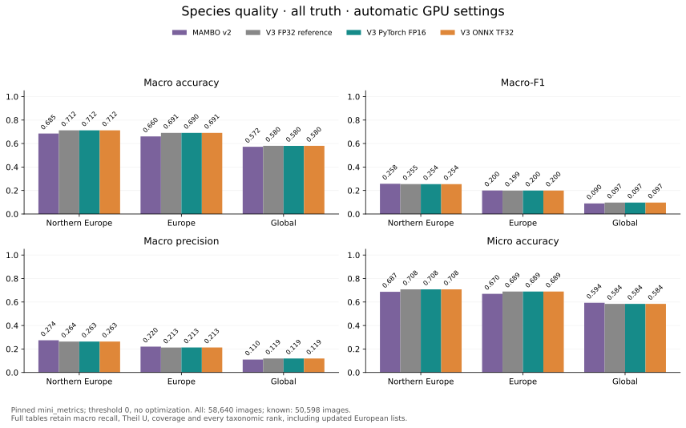
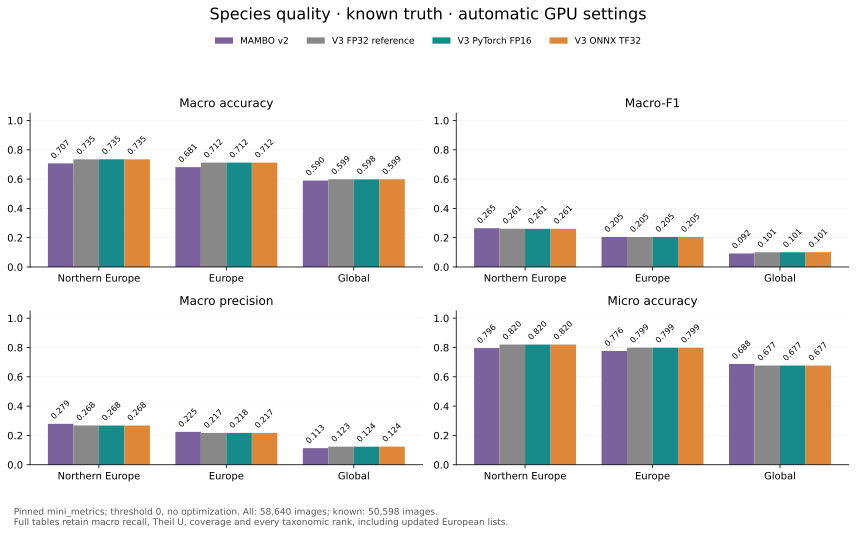
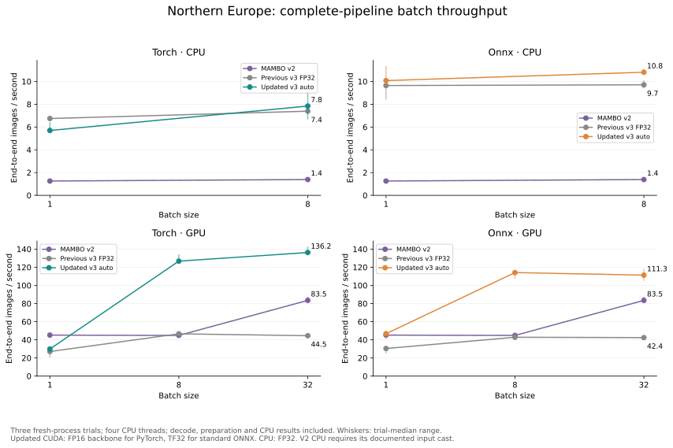
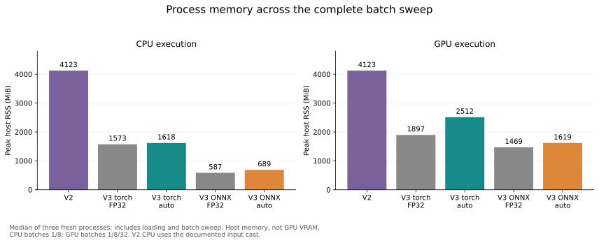

# Accelerated MAMBO deployment defaults

The deployment adapter now uses existing mixed-precision facilities and faster,
pixel-preserving preparation. Model weights, standard ONNX graphs, presets and
prediction interfaces remain the same.

| Execution | `precision="auto"` | Explicit reference |
|---|---|---|
| PyTorch CUDA | FP16 backbone autocast; FP32 classifier and embeddings | `precision="fp32"` disables autocast |
| ONNX CUDA | TF32 execution of the standard FP32 graph | `precision="fp32"` disables TF32 |
| CPU, either backend | FP32 | `precision="fp32"` |

Native `precision="bf16"` is available on CUDA devices with native BF16 support.
It passed the 4,096-image qualification but is not the automatic choice or a
full-dataset baseline. FP16 has broader hardware support and showed smaller
sampled changes from FP32. ONNX does not inherit PyTorch autocast settings.
Native PyTorch respects caller TF32 flags; comparison runs explicitly disable
both matmul and cuDNN TF32 for its FP32 reference.

The adapter keeps interpolation arithmetic unchanged, makes intermediate arrays
contiguous and computes only the retained crop. `threads` bounds ordered parallel
image preparation and ONNX CPU execution; use 1 for serial preparation. There is
no persistent worker service, new dependency, model conversion or additional
artifact to distribute. CPU preparation and model execution remain sequential;
more complex overlap is unnecessary for this increment.

## Qualification

Both native FP16/BF16 and ONNX TF32 were qualified on the same seeded 4,096-image
subset against FP32. All predictive scores use the pinned mini_metrics revision,
threshold zero and no optimization. Prepared pixels were byte-identical on 256
real images plus frozen synthetic edge cases. Outputs and normalized embeddings
remain float32. Prediction/embedding modes agreed on the checked species labels;
custom-list filtering and same-batch embedding equivalence passed.

The installed ONNX-only wheel also passed offline API/CLI inference with a relocated,
read-only bundle and no torch/training-package dependency. Runtime tests cover
precision routing, unsupported configurations, FP32 classifier execution under an
outer autocast context, original preprocessing pixels and ordered batching.

## Full evaluation and timing

Both accelerated backends completed all **58,640 Flemming images**, using the
same five presets and sample order as the FP32 reference. Every predictive metric
comes from `mini_metrics` commit `70cc69adc05362863439277048e06386c1f885e1`:
`threshold=0`, `optimal=False`, `simple=True`, `hierarchical=False`.
The primary results include all truth, including species outside the selected list.
Known-truth results retain 50,598 images at species level; membership is checked
separately at each rank. The [metric definitions](mambo-release-comparison.md#prediction-quality)
explain the different macro denominators, including predicted-only classes in F1.

| Preset | v2 macro accuracy | v3 FP32 | v3 PyTorch FP16 | v3 ONNX TF32 |
|---|---:|---:|---:|---:|
| Northern Europe | 68.52% | 71.24% | 71.25% | 71.24% |
| Europe | 66.04% | 69.06% | 69.05% | 69.06% |
| Global | 57.21% | 58.03% | 58.01% | 58.03% |
| Updated northern Europe | — | 70.49% | 70.46% | 70.49% |
| Updated Europe | — | 68.88% | 68.86% | 68.88% |

These are **macro species accuracies over all truth**. Northern-Europe macro-F1
is 0.2575 for v2, 0.2545 for v3 FP32, and 0.2543 for both accelerated paths.
The updated northern-Europe list gives 0.2368 / 0.2365 for PyTorch / ONNX.
Broader occurrence coverage changes the candidate vocabulary; these lists were
not tuned to Flemming. No precision variant uniformly improves every score. Across all five presets,
three ranks and both truth populations, the largest macro-accuracy difference
from FP32 is below 0.094 percentage points.





The [complete metric CSV](assets/mambo-accelerated-metrics.csv) retains 108 rows /
756 scores: macro accuracy, precision, recall and F1, micro accuracy, Theil U and
coverage, at species/genus/family level for both populations and all five v3 lists.
The [compact evidence](assets/mambo-accelerated-comparison.json) includes hashes
and can regenerate the figures without access to the image dataset.

### Speed and memory



Northern Europe, **images per second** (higher is better):

| Pipeline | CPU batch 1 | CPU batch 8 | GPU batch 1 | GPU batch 8 | GPU batch 32 |
|---|---:|---:|---:|---:|---:|
| MAMBO v2 | 1.26 | 1.39 | 45.2 | 44.8 | 83.5 |
| Original v3 PyTorch FP32 | 6.74 | 7.39 | 27.1 | 46.6 | 44.5 |
| Updated v3 PyTorch auto | 5.70 | 7.84 | 29.8 | 126.7 | **136.2** |
| Original v3 ONNX FP32 | 9.64 | 9.71 | 30.4 | 42.8 | 42.4 |
| Updated v3 ONNX auto | 10.08 | 10.81 | 46.7 | 114.1 | **111.3** |

At GPU batch 32, updated PyTorch is **3.06×** its original throughput and ONNX
is **2.62×**. Both exceed v2 here. Native batch-1 CPU throughput is lower in this
campaign (5.70 versus 6.74); this is not a uniform CPU speedup. Its trial medians
range from 5.45 to 6.45 images/s, and batch-8 results from 6.66 to 9.24.
ONNX CPU improves modestly. Batch 8 already approaches the new GPU throughput
limit, particularly for ONNX; larger batches are not always faster.



| Updated runtime | CPU peak host RSS | GPU-run peak host RSS | CPU loading + first image | GPU loading + first image |
|---|---:|---:|---:|---:|
| PyTorch | 1,618 MiB | 2,512 MiB | 42.04 s | 42.96 s |
| ONNX | 689 MiB | 1,619 MiB | 0.37 s | 1.46 s |

Host memory increases versus the previous v3 sweep, while remaining below v2.
Native peak allocated GPU memory falls from 865 to **598 MiB** (v2: 1,936 MiB).
These are PyTorch allocator counters, not total device memory; an equivalent ONNX
allocator peak is unavailable. Host RSS includes loading and the entire batch
sweep. Startup excludes interpreter launch and explicit runtime setup. Reuse a
loaded predictor; native classifier initialization remains a separate core issue.

These compare the combined adapter changes against the recorded pre-change
pipeline on the same i7-12800H / RTX 3080 Ti Laptop GPU (16 GB), Linux/WSL2,
on AC power. They do not isolate AMP from preprocessing, and laptop conditions
vary between runs. Three fresh-process trials use the same seeded image bank,
four CPU threads, two warmups and seven observations per cell. Error bars show
the range of trial medians; reported throughput uses the median of all 21
observations. All speed figures include decoding, preparation, inference and
completed CPU results. Native CPU model threads were also explicitly set to four.
The v2 CPU result requires its documented caller-side float32 input cast.

GPU scaling still saturates: preparation and execution remain sequential, and
classification/result handling also consume time. This increment removes major
avoidable costs without adding a streaming scheduler or changing model artifacts.

In-domain evaluation has since [completed on UCloud](mambo-indomain-evidence.md).
[Final qualification](../dev/releases/mambo_v3/final-qualification.md) records current
platform limits and publication readiness. BF16 in this study has subset qualification only. The
[original FP32 comparison](mambo-release-comparison.md) remains available as the
pre-optimization reference. No new model artifacts or quantization are involved.

## Reproduce

Use the existing environment without dependency synchronization. The metrics
environment stays pinned as described in the [evaluation workflow](../dev/releases/mambo_v3/evaluation.md).

```sh
python -m dev.releases.mambo_v3.qualify_precision \
  --bundle /path/to/bundle --manifest /path/to/flemming-manifest.json \
  --root /path/to/flemming --output /path/to/new-native-qualification \
  --backend torch --precisions fp32 fp16 bf16
python -m dev.releases.mambo_v3.qualify_precision \
  --bundle /path/to/bundle --manifest /path/to/flemming-manifest.json \
  --root /path/to/flemming --output /path/to/new-onnx-qualification \
  --backend onnx --precisions fp32 tf32
python -m dev.releases.mambo_v3.run_local full --precision auto \
  --python /path/to/gpu-env/bin/python --bundle /path/to/bundle \
  --manifest /path/to/flemming-manifest.json --root /path/to/flemming \
  --output /path/to/new-full-quality
/path/to/metrics-env/bin/python -m dev.releases.mambo_v3.metrics \
  --collection /path/to/new-full-quality
python -m dev.releases.mambo_v3.benchmark_acceleration \
  --python /path/to/gpu-env/bin/python --bundle /path/to/bundle \
  --manifest /path/to/flemming-manifest.json --root /path/to/flemming \
  --output /path/to/new-timings
python -m dev.releases.mambo_v3.acceleration_report \
  --reference docs/assets/mambo-release-comparison.json \
  --quality /path/to/new-full-quality --performance /path/to/new-timings \
  --output /path/to/charts
```

Run timing processes sequentially, with no competing GPU or CPU qualification.
