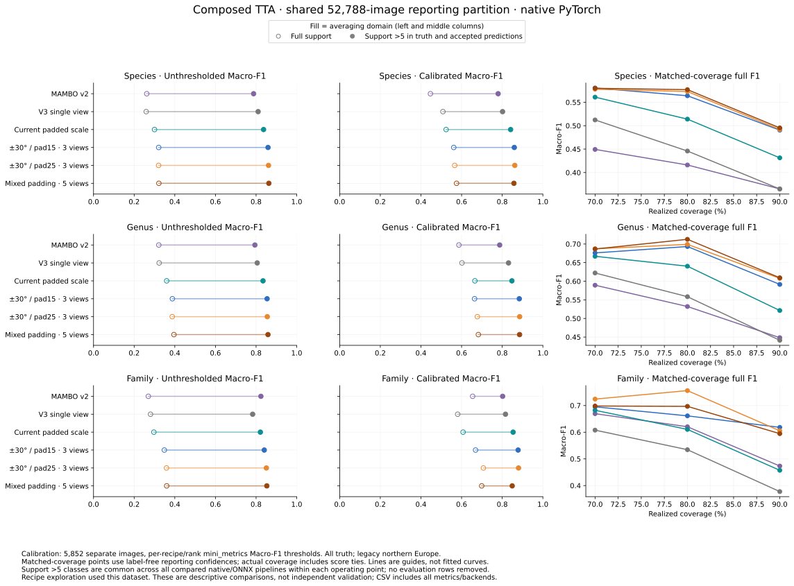

# Full composed-TTA comparison

**The best balanced candidate is original + ±30° rotation with 25% edge padding
(three views).** The full Flemming comparison confirms the preliminary improvement
over `padded_scale` on both native PyTorch and standard ONNX. The composed five-view
recipe gives smaller additional species/genus gains, but is not consistently better
at family level. The selected three-view recipe is now the enabled-TTA default; see the
[deployment README](../deployment/README.md) for the current five-pipeline comparison
and standalone runtime measurements. Explicit `padded_scale` retains the prior behavior.

## Findings

- **Three views, stronger composition:** unthresholded native macro-F1 improves
  from 0.3001/0.3601/0.2970 to 0.3201/0.3873/0.3592 at species/genus/family.
  On the common support >5 domain, the corresponding scores improve from
  0.8369/0.8342/0.8211 to 0.8612/0.8552/0.8506.
- **The benefit persists at matched coverage.** At approximately 80% coverage,
  full-support macro-F1 improves from 0.5140/0.6404/0.6105 to
  0.5729/0.6990/0.7560. This is more than merely accepting more predictions.
- **Recipe-specific calibration:** the three-view candidate reaches
  0.5661/0.6776/0.7074 full-support macro-F1 at 81.16%/84.32%/82.09% coverage,
  versus the current TTA's 0.5239/0.6655/0.6073 at 78.32%/77.73%/78.74%.
  Its calibrated family macro accuracy is lower (98.92% versus 99.56%), so the
  improvement is a coverage/F1 trade-off, not a win on every metric.
- **Five views remain an option, not the clear default.** Original + ±10° with
  15% padding + ±30° with 25% padding has the strongest unthresholded scores
  among these candidates. At 80% coverage its species/genus F1 is slightly higher
  than the three-view candidate (0.5770/0.7126), but family F1 is lower (0.6969).
  Its calibrated family threshold is also more restrictive: 76.72% coverage.
- **Backend agreement:** across all three new recipes, ranks, and unthresholded
  or matched-coverage points, the largest native/ONNX full-support macro-F1
  difference is 0.00263. Independently selected thresholds can differ; the JSON
  also evaluates ONNX at the corresponding native thresholds.

These are descriptive results from one out-of-domain dataset, without uncertainty
intervals. Recipe exploration used part of the reporting data; the separate
calibration partition does not make recipe selection independently validated.
Full-support macro-F1 is sensitive to rare and predicted-only classes, so the
common-support results and coverage must remain visible alongside it.

## Recipes and runtime scope

Every transformed view rotates the original decoded image on an expanded canvas
with bilinear interpolation, fills corners with RGB (124,116,104), then edge-pads
each side by the stated fraction of that axis. Ordinary deployment preprocessing
follows. Padding and rotation are nested within each view; no extra crop transform
is added. Recipes average FP32 leaf logits before regional filtering and hierarchy.

All 58,640 images were collected for each backend; seven shared views reconstruct
the three candidate recipes. Native used an FP16 backbone with an FP32 head;
ONNX used the standard floating graph with CUDA TF32, batch 32 and four workers.
First-batch aggregates matched the ordinary TTA API for every recipe within 1e-6.
The processes overlapped on the laptop GPU, so **collection elapsed times are not
inference-speed benchmarks**. The earlier [small warm benchmark](mambo-compact-tta.md)
measured roughly 50.7 images/s for this three-view candidate versus 53.3 for current
TTA; the new composed five-view recipe still needs standalone timing.

All quality results below use the same **52,788 reporting images**, with thresholds fitted on
5,852 separate calibration images. Every model uses legacy northern Europe and all truth,
including out-of-vocabulary labels. Metrics come from pinned `mini_metrics`. Recipe selection
used this dataset, including a reporting subset; this is not independent validation.

Metric cells show **full support / common support >5**. The latter requires more than five
truth instances and accepted predictions in every compared pipeline, separately per operating
point. Classes can differ between operating points. No evaluation rows are dropped.

## No confidence threshold

### Species

| Pipeline | Macro accuracy: full / >5 | Macro-F1: full / >5 | Coverage |
|---|---:|---:|---:|
| MAMBO v2 | 68.56% / 79.50% | 0.2620 / 0.7878 | 100.00% |
| V3 single view | 71.36% / 82.03% | 0.2593 / 0.8100 | 100.00% |
| Current padded scale | 74.06% / 84.80% | 0.3001 / 0.8369 | 100.00% |
| ±30° / pad15 · 3 views | 75.13% / 86.81% | 0.3207 / 0.8588 | 100.00% |
| ±30° / pad25 · 3 views | 74.94% / 86.96% | 0.3201 / 0.8612 | 100.00% |
| Mixed padding · 5 views | 75.52% / 87.16% | 0.3216 / 0.8628 | 100.00% |

### Genus

| Pipeline | Macro accuracy: full / >5 | Macro-F1: full / >5 | Coverage |
|---|---:|---:|---:|
| MAMBO v2 | 78.94% / 82.07% | 0.3213 / 0.7942 | 100.00% |
| V3 single view | 80.53% / 83.83% | 0.3230 / 0.8057 | 100.00% |
| Current padded scale | 83.13% / 86.42% | 0.3601 / 0.8342 | 100.00% |
| ±30° / pad15 · 3 views | 85.15% / 88.17% | 0.3881 / 0.8542 | 100.00% |
| ±30° / pad25 · 3 views | 84.73% / 88.13% | 0.3873 / 0.8552 | 100.00% |
| Mixed padding · 5 views | 85.27% / 88.53% | 0.3958 / 0.8586 | 100.00% |

### Family

| Pipeline | Macro accuracy: full / >5 | Macro-F1: full / >5 | Coverage |
|---|---:|---:|---:|
| MAMBO v2 | 84.35% / 87.00% | 0.2697 / 0.8238 | 100.00% |
| V3 single view | 81.05% / 85.70% | 0.2805 / 0.7831 | 100.00% |
| Current padded scale | 85.79% / 88.66% | 0.2970 / 0.8211 | 100.00% |
| ±30° / pad15 · 3 views | 86.25% / 89.19% | 0.3486 / 0.8403 | 100.00% |
| ±30° / pad25 · 3 views | 86.37% / 89.32% | 0.3592 / 0.8506 | 100.00% |
| Mixed padding · 5 views | 86.82% / 89.84% | 0.3601 / 0.8529 | 100.00% |

## Recipe-specific calibrated thresholds

### Species

| Pipeline | Macro accuracy: full / >5 | Macro-F1: full / >5 | Coverage |
|---|---:|---:|---:|
| MAMBO v2 | 84.65% / 95.21% | 0.4467 / 0.7799 | 69.73% |
| V3 single view | 86.69% / 96.35% | 0.5081 / 0.8016 | 70.81% |
| Current padded scale | 86.59% / 95.86% | 0.5239 / 0.8413 | 78.32% |
| ±30° / pad15 · 3 views | 86.43% / 96.34% | 0.5615 / 0.8595 | 80.67% |
| ±30° / pad25 · 3 views | 86.34% / 96.38% | 0.5661 / 0.8618 | 81.16% |
| Mixed padding · 5 views | 87.04% / 96.41% | 0.5753 / 0.8576 | 80.34% |

### Genus

| Pipeline | Macro accuracy: full / >5 | Macro-F1: full / >5 | Coverage |
|---|---:|---:|---:|
| MAMBO v2 | 95.34% / 97.55% | 0.5869 / 0.7875 | 69.81% |
| V3 single view | 95.48% / 97.31% | 0.6019 / 0.8311 | 75.75% |
| Current padded scale | 96.28% / 97.71% | 0.6655 / 0.8477 | 77.73% |
| ±30° / pad15 · 3 views | 96.25% / 97.54% | 0.6639 / 0.8840 | 84.29% |
| ±30° / pad25 · 3 views | 95.77% / 97.55% | 0.6776 / 0.8858 | 84.32% |
| Mixed padding · 5 views | 96.07% / 97.51% | 0.6825 / 0.8855 | 84.46% |

### Family

| Pipeline | Macro accuracy: full / >5 | Macro-F1: full / >5 | Coverage |
|---|---:|---:|---:|
| MAMBO v2 | 99.64% / 99.58% | 0.6545 / 0.8021 | 77.44% |
| V3 single view | 99.33% / 99.22% | 0.5807 / 0.8161 | 73.06% |
| Current padded scale | 99.56% / 99.49% | 0.6073 / 0.8536 | 78.74% |
| ±30° / pad15 · 3 views | 98.92% / 98.75% | 0.6689 / 0.8782 | 81.84% |
| ±30° / pad25 · 3 views | 98.92% / 98.75% | 0.7074 / 0.8802 | 82.09% |
| Mixed padding · 5 views | 99.46% / 99.37% | 0.6990 / 0.8491 | 76.72% |



## Support excluded from the averaging domain

| Setting | Rank | Common classes | Truth images outside / % |
|---|---|---:|---:|
| zero | species | 308 | 8,145 / 15.43% |
| zero | genus | 242 | 221 / 0.42% |
| zero | family | 20 | 5 / 0.01% |
| optimized | species | 272 | 10,010 / 18.96% |
| optimized | genus | 215 | 5,920 / 11.21% |
| optimized | family | 19 | 18 / 0.03% |
| coverage_70 | species | 270 | 10,083 / 19.10% |
| coverage_70 | genus | 210 | 5,999 / 11.36% |
| coverage_70 | family | 19 | 18 / 0.03% |
| coverage_80 | species | 282 | 9,352 / 17.72% |
| coverage_80 | genus | 220 | 5,291 / 10.02% |
| coverage_80 | family | 19 | 18 / 0.03% |
| coverage_90 | species | 295 | 8,532 / 16.16% |
| coverage_90 | genus | 231 | 4,756 / 9.01% |
| coverage_90 | family | 19 | 18 / 0.03% |

Predicted-only classes have zero truth images and can still strongly affect macro-F1.
These are not rejection counts. Coverage is unchanged by support truncation.

## Evidence and interpretation

The [CSV](assets/mambo-composed-tta.csv) includes both backends, all ranks, macro accuracy,
precision, recall, F1, micro accuracy, Theil U, coverage, thresholds and retained-support counts.
The [JSON](assets/mambo-composed-tta.json) also records exact class sets, source hashes and
partition identities. Its ONNX entries include native-threshold comparisons to distinguish
backend differences from calibration differences.

Matched-coverage thresholds are selected from reporting confidence scores without using truth
labels; their realized coverage is computed by mini_metrics and may differ slightly because of
ties. They are diagnostic operating points, not deployment-calibrated thresholds.

## Reproduction and provenance

Collection: `dev.releases.mambo_v3.composed_full`, with `--backend torch` or
`--backend onnx`, the verified release bundle, full Flemming manifest and image root.
Use a fresh output directory for each backend. Analysis and figure generation:

```bash
/tmp/mambo-release-metrics/bin/python -m dev.releases.mambo_v3.composed_metrics \
  --root local-evidence/mambo-composed-full \
  --output local-evidence/mambo-composed-full/analysis
.venv/bin/python -m dev.releases.mambo_v3.composed_report \
  --data local-evidence/mambo-composed-full/analysis/composed-comparison.json \
  --output local-evidence/mambo-composed-report
```

The metric environment must contain the pinned mini_metrics revision recorded in
the JSON. The figure/table generator recreates the numeric report; the findings
above are the accompanying interpretation. Retained local `torch/report.json` and
`onnx/report.json` contain manifest, bundle, runner, transform and prediction hashes.
The native run predates the runtime-metadata correction: its top-level
`effective_precision=fp16` describes execution; its older nested initial runtime
flags do not. Original evidence is preserved without rewriting those records.

All five retained baseline models reproduced their previous unthresholded and
calibrated full-support metrics within 1e-12. The support >5 domain here intersects
**all eleven pipelines**, so it need not equal the five-pipeline domain in earlier
reports. Source hashes and exact reporting/calibration identities are checked
before evaluation. This study did not change core-module behavior. The subsequent deployment promotion
changes only the enabled-TTA preset, while TTA remains off by default.
