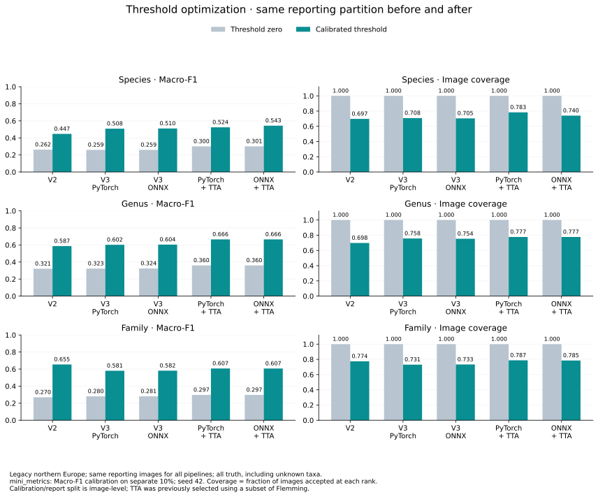
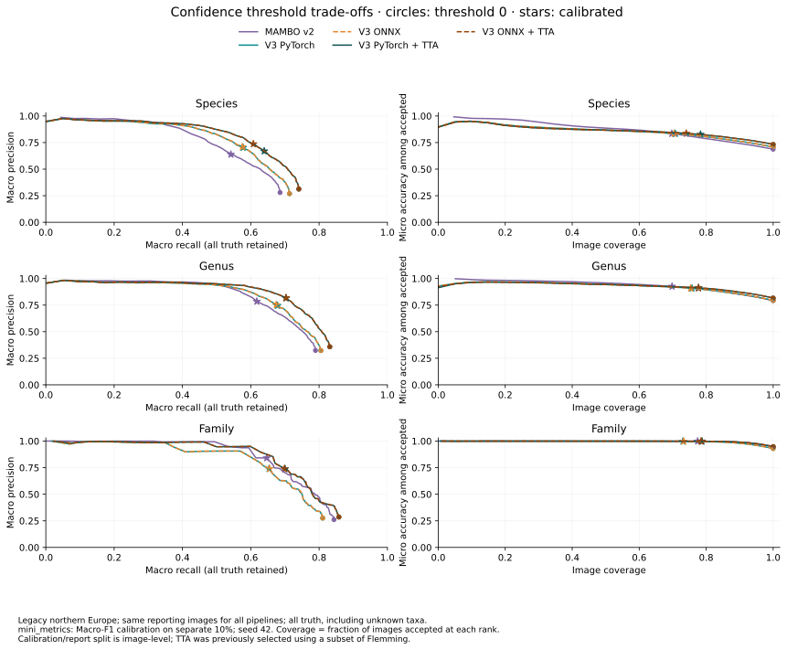

# Confidence thresholds and the MAMBO comparison

Thresholding substantially changes the quality comparison, at the cost of rejecting
images. These results use **legacy northern Europe** for V2, V3 PyTorch/ONNX and
both V3 backends with padded-scale TTA. Deployment defaults remain threshold zero.

## Method and interpretation

Every predictive metric, threshold selection and dataset split uses the existing
`mini_metrics` machinery at revision `70cc69adc05362863439277048e06386c1f885e1`,
the same revision as the unthresholded comparison. No metric is reimplemented.

- `MetricDF.split((0.9, 0.1), strata=("label",), seed=42)` yields **5,852 calibration
  images and 52,788 reporting images**. Splitting groups all ranks by image ID.
  Identity hashes verify identical partitions and truth across all five pipelines.
- `OptimalConfidenceThreshold(crit=MacroF1, eps=0.01, use_quantiles=True,
  n_bootstraps=0)` selects one threshold per rank and pipeline on calibration only.
  The package uses its exact F1 curve and connected near-optimal plateau selector;
  “optimized” means the package's tolerance-based selection, not necessarily the
  exact maximizer. Explicit results match `evaluate_file(optimal=True, seed=42)`.
- Both threshold-zero and calibrated scores below use **the same reporting partition**,
  including unknown truth. Do not compare these directly with full-58,640-image
  scores as though thresholding were the only difference. Full-data threshold-zero
  scores were separately recomputed and matched the existing comparison.
- Coverage is `mini_metrics` image-level acceptance fraction, separately at each rank:
  `confidence >= threshold`. It is not vocabulary coverage. Thresholds are independent
  per rank; these are simple rank metrics (`hierarchical=False`), not an enforced
  species-to-family fallback policy.
- Macro accuracy averages accuracy among accepted predictions within truth taxa,
  excluding taxa with no accepted predictions. Micro accuracy is accuracy among
  all accepted images. Recall retains rejected truth as misses; Macro-F1 also
  penalizes rejection and includes truth-supported or retained predicted-only taxa.
  Precision uses the package's predicted-class averaging. Always interpret rising
  accuracy/precision with coverage and recall, especially near total rejection.

This is a single image-level split, not observation/site-level validation or a
threshold stability study. TTA was selected earlier using a subset of Flemming;
this split does not make the entire model/TTA selection independently validated.
Threshold values are specific to these pipelines, confidence definitions and this
preset. They are candidate operating points, not universal deployment defaults.

## Effect on the model comparison

Calibration improves Macro-F1 for every pipeline at every rank, with reduced
coverage and recall. At species level, ordinary V3 moves ahead of V2 in Macro-F1;
with threshold zero, its F1 was slightly lower. TTA improves species and genus
Macro-F1 further. **Family reverses the unthresholded F1 ranking: V2 leads all V3
variants after calibration** (0.6545 versus about 0.581 without TTA and 0.607 with
TTA). V3 + TTA retains more family recall than V2, so this is a trade-off rather
than uniform dominance. These operating points need not have equal coverage.
The [family-level audit](mambo-family-precision.md) traces the reversal to 7
predicted-only families surviving V3 thresholds versus 3 for V2. Precision within
the same 22 truth-present predicted families is actually higher for V3.



### Species

| Pipeline | Threshold | Macro-F1 zero → calibrated | Coverage | Macro accuracy | Micro accuracy | Macro precision | Macro recall |
|---|---:|---:|---:|---:|---:|---:|---:|
| MAMBO v2 | 0.7484 | 0.2620 → 0.4467 | 69.73% | 84.65% | 83.40% | 0.6381 | 0.5418 |
| V3 PyTorch | 0.8100 | 0.2593 → 0.5081 | 70.81% | 86.69% | 83.38% | 0.7028 | 0.5775 |
| V3 ONNX | 0.8162 | 0.2594 → 0.5100 | 70.45% | 86.95% | 83.45% | 0.7089 | 0.5753 |
| V3 PyTorch + TTA | 0.7393 | 0.3001 → 0.5239 | 78.32% | 86.59% | 82.57% | 0.6695 | 0.6393 |
| V3 ONNX + TTA | 0.8280 | 0.3011 → 0.5431 | 74.05% | 87.55% | 83.56% | 0.7363 | 0.6076 |

Coverage at threshold zero is 100%; all other columns except the before/after F1 pair use calibrated thresholds.

### Genus

| Pipeline | Threshold | Macro-F1 zero → calibrated | Coverage | Macro accuracy | Micro accuracy | Macro precision | Macro recall |
|---|---:|---:|---:|---:|---:|---:|---:|
| MAMBO v2 | 0.8760 | 0.3213 → 0.5869 | 69.81% | 95.34% | 92.58% | 0.7848 | 0.6177 |
| V3 PyTorch | 0.8211 | 0.3230 → 0.6019 | 75.75% | 95.48% | 90.77% | 0.7454 | 0.6784 |
| V3 ONNX | 0.8302 | 0.3245 → 0.6043 | 75.37% | 95.52% | 90.86% | 0.7523 | 0.6746 |
| V3 PyTorch + TTA | 0.8699 | 0.3601 → 0.6655 | 77.73% | 96.28% | 91.16% | 0.8167 | 0.7031 |
| V3 ONNX + TTA | 0.8709 | 0.3605 → 0.6655 | 77.69% | 96.30% | 91.18% | 0.8169 | 0.7032 |

Coverage at threshold zero is 100%; all other columns except the before/after F1 pair use calibrated thresholds.

### Family

| Pipeline | Threshold | Macro-F1 zero → calibrated | Coverage | Macro accuracy | Micro accuracy | Macro precision | Macro recall |
|---|---:|---:|---:|---:|---:|---:|---:|
| MAMBO v2 | 0.9553 | 0.2697 → 0.6545 | 77.44% | 99.64% | 99.86% | 0.8413 | 0.6467 |
| V3 PyTorch | 0.9708 | 0.2805 → 0.5807 | 73.06% | 99.33% | 99.80% | 0.7406 | 0.6535 |
| V3 ONNX | 0.9699 | 0.2809 → 0.5816 | 73.26% | 99.33% | 99.80% | 0.7406 | 0.6549 |
| V3 PyTorch + TTA | 0.9648 | 0.2970 → 0.6073 | 78.74% | 99.56% | 99.82% | 0.7394 | 0.7002 |
| V3 ONNX + TTA | 0.9665 | 0.2971 → 0.6065 | 78.47% | 99.56% | 99.83% | 0.7395 | 0.6987 |

Coverage at threshold zero is 100%; all other columns except the before/after F1 pair use calibrated thresholds.

## TTA backend threshold sensitivity

The selected species threshold differs substantially between PyTorch (0.7393)
and ONNX (0.8280). Applying **each threshold to both backends** isolates the effect:

| Shared species threshold | PyTorch TTA Macro-F1 / coverage | ONNX TTA Macro-F1 / coverage |
|---|---:|---:|
| 0.7393 | 0.5239 / 78.32% | 0.5238 / 78.30% |
| 0.8280 | 0.5433 / 74.06% | 0.5431 / 74.05% |

Both thresholds are within 0.01 of each backend's calibration maximum Macro-F1
(about 0.6347). The package's near-optimal selector chooses different operating
points, while performance at shared thresholds is almost identical. The apparent
ONNX advantage in the calibrated species table is therefore chiefly a threshold
selection effect, not evidence of a better ONNX model. We retain the actual selected
values rather than choosing a new winner using the reporting data. This check
illustrates why threshold stability deserves validation before setting defaults.

## Precision–recall and accuracy–coverage curves



Left: macro precision versus macro recall for all five pipelines at each rank.
Right: accepted-image micro accuracy versus image coverage. ONNX curves are dashed.
Circles denote threshold
zero; stars denote the calibration-selected thresholds, evaluated on reporting data.
Comparing at similar coverage helps distinguish discrimination from more aggressive
rejection. The operating points optimize Macro-F1, not a common coverage target.

These are **top-prediction rejection curves**, not one-vs-rest curves built from
every class probability, and no average-precision/AUC claim is made. Each plotted
point comes from `evaluate_file` on the reporting partition. The sampled grid uses
51 evenly spaced confidence thresholds, 21 calibration-confidence quantiles per
rank, and each selected threshold, with duplicates removed. Lines connect points
in threshold order without smoothing or a monotonic envelope; class membership
changes can make macro precision irregular. The optimizer itself uses the exact
calibration F1 curve, not this plotting grid. Undefined package results remain null.

## Evidence and reproduction

The [metric table](assets/mambo-threshold-metrics.csv) contains all/known-truth
reporting scores before and after thresholding, calibration scores, threshold
values, Theil U and coverage. Known-only scores reuse thresholds calibrated on all
truth; they do not recalibrate on a different population. The [compact evidence](assets/mambo-threshold-comparison.json)
also retains every curve point, source CSV hashes, partition hashes and full-data
threshold-zero checks. Predictions and inference speed are unchanged.

```sh
/path/to/pinned-metrics-env/bin/python -m dev.releases.mambo_v3.threshold_report \
  --evidence local-evidence --output local-evidence/mambo-threshold-study
.venv/bin/python -m dev.releases.mambo_v3.threshold_report \
  --data local-evidence/mambo-threshold-study/mambo-threshold-comparison.json \
  --output /tmp/mambo-threshold-charts
```

The collector uses the retained prediction directories named in `SOURCES` in
[the analysis script](../dev/releases/mambo_v3/threshold_report.py); those local
model outputs are not shipped in Git. The committed compact evidence can regenerate
the charts without predictions or model inference using `--data`.

Before enabling calibrated thresholds in deployment, validate the intended
coverage/recall trade-off on the target workflow and define per-rank abstention or
fallback behavior. The current deployment CLI exposes one scalar threshold; these
three independently calibrated thresholds should not be silently substituted for it.
