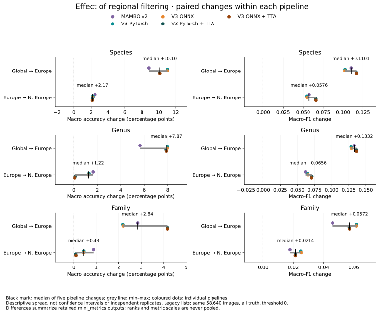
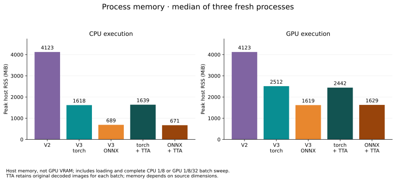

# MAMBO deployment defaults and release comparison

Ordinary inference stays single-view. Enabling TTA with `tta=True` or bare `--tta`
selects **padded scale**: the original image plus views with 8% and 15% edge padding.
Each view uses unchanged preprocessing; FP32 leaf logits are averaged before
class-list filtering and hierarchy reduction. Use `tta="padded_scale"` to pin the
recipe explicitly, or `tta=False` / `--tta none` to disable it.

This is the best measured **accuracy/cost compromise** among the explored policies,
not a claim of optimality for every metric. It had the highest subset macro
accuracy, used only three views and was faster than D4 or padded rotations.
Padded rotations had higher subset macro-F1. The [candidate study](mambo-tta.md)
retains all 13 recipes, exact parameters, sources and their trade-offs.

## Full Flemming comparison

Both V3 backends were evaluated on all **58,640 images / 522 truth species**, with
and without TTA at automatic GPU precision. Main comparisons use the identical legacy
northern-Europe vocabulary across V2/V3. Regional effects are summarized once
below; the supplementary tables retain all regional and updated-list results.
All predictive metrics come from `mini_metrics` commit
`70cc69adc05362863439277048e06386c1f885e1`, using `threshold=0`, `optimal=False`,
`simple=True`, `hierarchical=False`.

The primary charts include **all truth** at each rank, including out-of-vocabulary
taxa. Macro accuracy gives equal weight to ground-truth taxa at that rank; macro-F1/precision
also reflect predicted-only classes under the package's metric policy. See the
[metric definitions](mambo-release-comparison.md#prediction-quality). The TTA
recipe was selected using a 1,024-image subset of this same dataset: the full
results are descriptive comparisons, **not independent validation**.

### Northern-Europe preset choice

Use legacy `north_europe` for the northern-Europe workflow and V2/V3 comparisons.
It retains the 1,977-species V2 vocabulary. The explicit `north_europe_v3` option
adds 222 species without removals, using the same geographic filter and a minimum
of 3 regional records instead of 26 (plus the new global minimum of 25).
Both cover the same 50,598 species-labelled images in Flemming (86.29%).

Holding PyTorch inference fixed, the updated list changes macro accuracy:

| Rank | Legacy | Updated | Legacy + TTA | Updated + TTA |
|---|---:|---:|---:|---:|
| Species | 71.25% | 70.46% | 73.95% | 73.10% |
| Genus | 80.53% | 80.01% | 83.04% | 82.78% |
| Family | 81.05% | 80.66% | 85.72% | 83.47% |

ONNX shows the same pattern; macro-F1 and micro accuracy also favour legacy at
all three ranks. The updated list permits additional plausible regional species,
but Flemming contains no examples of those additions. Their recognition benefit
is therefore unmeasured here. Legacy combines better measured discrimination with
backwards compatibility; updated membership remains an explicit broader option.
This is a northern-Europe recommendation, not a change to the API's legacy
`europe` default. See [geographic definitions](model-presets.md).


### Species

| Pipeline | Macro accuracy | Macro-F1 | Micro accuracy |
|---|---:|---:|---:|
| MAMBO v2 | 68.52% | 0.2575 | 68.71% |
| V3 PyTorch | 71.25% | 0.2543 | 70.78% |
| V3 ONNX | 71.24% | 0.2543 | 70.78% |
| V3 PyTorch + TTA | 73.95% | 0.2935 | 73.19% |
| V3 ONNX + TTA | 73.98% | 0.2944 | 73.19% |

### Genus

| Pipeline | Macro accuracy | Macro-F1 | Micro accuracy |
|---|---:|---:|---:|
| MAMBO v2 | 78.90% | 0.3169 | 79.23% |
| V3 PyTorch | 80.53% | 0.3204 | 79.37% |
| V3 ONNX | 80.50% | 0.3212 | 79.36% |
| V3 PyTorch + TTA | 83.04% | 0.3532 | 81.59% |
| V3 ONNX + TTA | 83.04% | 0.3536 | 81.59% |

### Family

| Pipeline | Macro accuracy | Macro-F1 | Micro accuracy |
|---|---:|---:|---:|
| MAMBO v2 | 84.40% | 0.2691 | 94.49% |
| V3 PyTorch | 81.05% | 0.2804 | 92.97% |
| V3 ONNX | 81.06% | 0.2808 | 92.99% |
| V3 PyTorch + TTA | 85.72% | 0.2967 | 94.77% |
| V3 ONNX + TTA | 85.73% | 0.2967 | 94.77% |

Ordinary V3 improves species and genus macro accuracy, but family macro accuracy
falls from 84.40% to about 81.05%. TTA raises family macro accuracy to 85.72–85.73%,
and improves species and genus results as well. Species macro-F1 is slightly
lower than V2 without TTA and higher with TTA.

### Regional filtering effect



Each point is a difference between two presets **within the same pipeline**.
The black mark is the median of the five changes (V2, V3 PyTorch/ONNX, and each V3
backend with TTA); grey lines show their min–max range. These related pipelines
are not independent replicates: the summary is descriptive, without confidence
intervals or significance claims. Each rank and metric is summarized separately.
All comparisons retain the same 58,640 images, including out-of-vocabulary truth.
The regional benefit is evidence for this northern-European dataset, not a reason
to apply its narrow vocabulary to images from elsewhere.

The [supplementary regional comparison](mambo-regional-comparison.md) retains
all preset tables and all/known-truth charts. The [complete metric CSV](assets/mambo-defaults-metrics.csv)
also retains precision, recall, Theil U and coverage. For legacy northern Europe,
known truth contains 50,598 images at species, 58,639 at genus and 58,640 at family.

## Confidence threshold optimization

Thresholding changes the comparison. Using `mini_metrics` Macro-F1 calibration on
5,852 images and reporting on the same remaining 52,788 images for every pipeline:

| Pipeline | Species Macro-F1 / coverage | Genus Macro-F1 / coverage | Family Macro-F1 / coverage |
|---|---:|---:|---:|
| MAMBO v2 | 0.4467 / 69.73% | 0.5869 / 69.81% | 0.6545 / 77.44% |
| V3 PyTorch | 0.5081 / 70.81% | 0.6019 / 75.75% | 0.5807 / 73.06% |
| V3 ONNX | 0.5100 / 70.45% | 0.6043 / 75.37% | 0.5816 / 73.26% |
| V3 PyTorch + TTA | 0.5239 / 78.32% | 0.6655 / 77.73% | 0.6073 / 78.74% |
| V3 ONNX + TTA | 0.5431 / 74.05% | 0.6655 / 77.69% | 0.6065 / 78.47% |

Ordinary V3 overtakes V2 on species Macro-F1 after calibration; TTA improves
species and genus further. **V2 leads calibrated family Macro-F1**, while V3 + TTA
retains more family recall. The different TTA species operating points largely
explain the backend F1 gap: at a shared threshold, PyTorch and ONNX remain closely
aligned. Higher accepted accuracy comes with abstention; coverage is the fraction
of images accepted independently at each rank.

The [threshold study](mambo-confidence-thresholds.md) shows matched-partition
before/after metrics, exact thresholds, recall, coverage, and five-pipeline P–R and
accuracy–coverage curves for all three ranks. These 90% reporting scores are not
directly comparable with the full-data tables above. Deployment defaults remain
threshold zero; these are dataset-specific candidate operating points.

## Inference speed and memory


Northern Europe, images/second:

| Pipeline | CPU B1 | CPU B8 | GPU B1 | GPU B8 | GPU B32 |
|---|---:|---:|---:|---:|---:|
| MAMBO v2 | 1.26 | 1.39 | 45.2 | 44.8 | 83.5 |
| V3 PyTorch | 5.70 | 7.84 | 29.8 | 126.7 | 136.2 |
| V3 ONNX | 10.08 | 10.81 | 46.7 | 114.1 | 111.3 |
| V3 PyTorch + TTA | 2.29 | 2.63 | 8.5 | 42.7 | 50.4 |
| V3 ONNX + TTA | 3.56 | 3.66 | 16.8 | 41.7 | 39.4 |

At GPU batch 32, TTA takes about **2.70× the native time / 2.82× the ONNX time**
per image versus ordinary V3. It is slower than V2 on GPU at that batch size,
while still faster than V2 in these CPU measurements. These are measured pipeline
trade-offs, not a uniform speed or quality ranking across every setting.

These are complete-pipeline **images per second**, including decoding, preparation,
inference and completed CPU results. TTA runs all three views inside that boundary.
The [acceleration study](mambo-accelerated-deployment.md) retains the earlier FP32
comparison and the AMP/preparation improvements. Both backends here use automatic
precision: FP16 backbone / FP32 head on native CUDA,
TF32 execution of the standard FP32 ONNX graph on CUDA, and FP32 on CPU.

TTA timings use three fresh-process trials, two warmups and seven observations
per cell, the same seeded 32-image bank and four preparation/runtime CPU threads
as the retained V2 and ordinary V3 measurements. CPU batches are 1/8; GPU batches
are 1/8/32. Throughput uses the median of 21 observations; error bars show the
range of trial medians. The hardware is an i7-12800H / RTX 3080 Ti Laptop (16 GB),
Linux/WSL2 on AC power. Campaigns were run separately, so laptop conditions can
vary. V2 CPU uses the documented caller-side float32 input cast.



| Pipeline | CPU host MiB | GPU-run host MiB | CPU first-use s | GPU first-use s | Native GPU allocated MiB |
|---|---:|---:|---:|---:|---:|
| MAMBO v2 | 4123 | 4123 | 209.40 | 209.60 | 1936 |
| V3 PyTorch | 1618 | 2512 | 42.04 | 42.96 | 598 |
| V3 ONNX | 689 | 1619 | 0.37 | 1.46 | — |
| V3 PyTorch + TTA | 1639 | 2442 | 43.27 | 44.05 | 597 |
| V3 ONNX + TTA | 671 | 1629 | 0.53 | 1.72 | — |

First use includes construction, lazy loading and the first prediction, excluding
interpreter launch and explicit runtime setup. Native classifier initialization
still dominates startup; reusing a predictor avoids repeating it. Loading and
allocator variation influence process peaks.

Peak host RSS includes model loading and the entire batch sweep. Native allocated
GPU memory is a PyTorch allocator counter, not total VRAM; an equivalent ONNX peak
is unavailable. TTA holds the decoded source batch plus the current prepared view;
it does not multiply the model batch size by the number of views. Host memory
therefore depends on source image dimensions as well as batch size.

Use ordinary V3 for throughput-sensitive workflows and enable TTA when the measured
accuracy/cost trade-off fits the application. Reuse a loaded predictor. Tune
`preprocess_workers` independently of ONNX `threads`; the [loading study](mambo-loading-scaling.md)
explains why higher batches or more workers are not automatically faster.
In-domain UCloud evaluation, other operating systems and downstream embedding
quality remain separate qualification work.

## Reproduce

```sh
python -m dev.releases.mambo_v3.run_local full --precision auto --tta padded_scale \
  --python /path/to/gpu-env/bin/python --bundle /path/to/bundle \
  --manifest /path/to/flemming-manifest.json --root /path/to/flemming \
  --output /path/to/new-tta-quality
/path/to/pinned-metrics-env/bin/python -m dev.releases.mambo_v3.metrics \
  --collection /path/to/new-tta-quality
python -m dev.releases.mambo_v3.benchmark_acceleration --tta padded_scale \
  --python /path/to/gpu-env/bin/python --bundle /path/to/bundle \
  --manifest /path/to/flemming-manifest.json --root /path/to/flemming \
  --output /path/to/new-tta-timings
python -m dev.releases.mambo_v3.defaults_report \
  --baseline docs/assets/mambo-accelerated-comparison.json \
  --reference docs/assets/mambo-release-comparison.json \
  --quality /path/to/new-tta-quality --performance /path/to/new-tta-timings \
  --output /path/to/charts
```

Run timing processes sequentially without other CPU/GPU jobs. All reported speed
is end-to-end; the benchmark's separately labelled prepared-input diagnostic is
single-view even when TTA is enabled, and is not used in these comparisons.
The [compact evidence](assets/mambo-defaults-comparison.json) includes source hashes
and regenerates the figures with `defaults_report --data FILE --output DIRECTORY`.
