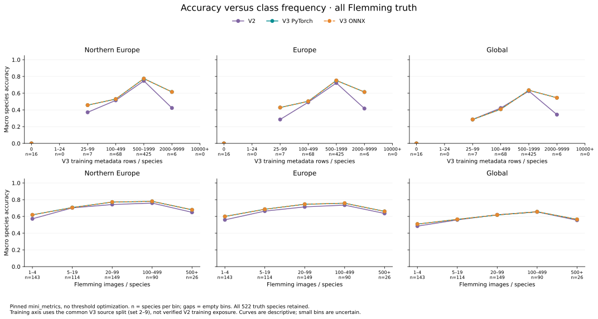

# Accuracy versus class frequency

**Historical padded-scale TTA evidence.** The [deployment README](../deployment/README.md#release-comparison)
contains the current rotation-and-padding default comparison.



These curves compare MAMBO v2 with the single-view automatic v3 PyTorch/ONNX paths on the same
58,640 Flemming images. Northern Europe leads; Europe and global use the same
legacy lists in both releases. All 522 truth species remain in the main curves.

Every bin's macro and micro accuracy is computed by pinned `mini_metrics`
`70cc69adc05362863439277048e06386c1f885e1`, with threshold 0, no optimization,
`simple=True` and `hierarchical=False`. The plot leads with **macro species
accuracy**, giving equal weight to each ground-truth species within a bin. Lines
connect descriptive bins; they are not fitted learning curves. Labels report the
number of species in each bin, and gaps denote empty bins.

The two axes answer different questions:

- **Training frequency:** rows per species in the pinned v3 source metadata's
  training split, `set` 2–9. The split contains 5,063,857 rows. Validation (`set=1`)
  and test (`set=0`) are excluded, with no extra deduplication. This is a common
  reference axis for both models, **not verified v2 training exposure**, an epoch
  count or a measure of effective exposure under sampling/pretraining.
- **Flemming frequency:** images per truth species in this expert evaluation set.
  It describes evaluation support, not abundance in nature or training frequency.
  Species with few images have particularly uncertain individual accuracies.

For northern Europe, v3 improves macro accuracy in every occupied Flemming-support
bin. For species with 1–4 evaluation images, it rises from about **57.2% to 61.9%**;
for 20–99 images, from **74.2% to 77.1%**. The curves are not monotonic. In particular,
the highest occupied training bin contains only six species, so its shape should
not be generalized to common species overall. The 16 species absent from the
training metadata are outside the vocabulary and have zero species accuracy here.

The [compact data](assets/mambo-frequency-comparison.json) retains bin counts,
image denominators, all/known-truth macro and micro accuracy, per-species support,
source hashes and metric provenance. Known-only results exclude truth outside the
selected vocabulary; the plotted all-truth curves do not.

## Reproduce

```sh
python -m dev.releases.mambo_v3.frequency_comparison counts \
  --metadata /path/to/pinned-metadata.parquet --output /path/to/new-counts.json
/path/to/pinned-metrics-env/bin/python -m dev.releases.mambo_v3.frequency_comparison measure \
  --counts /path/to/new-counts.json --v2 /path/to/v2-full \
  --v3 /path/to/mambo-accelerated-quality --output /path/to/new-frequency.json
python -m dev.releases.mambo_v3.frequency_comparison render \
  --data /path/to/new-frequency.json --output /path/to/charts
```

The metadata hash must match `construction.toml`. The measurement step checks
completed prediction reports, CSV hashes and identical image/truth identities.
The rendering step needs only the compact JSON, not images or the large metadata.
