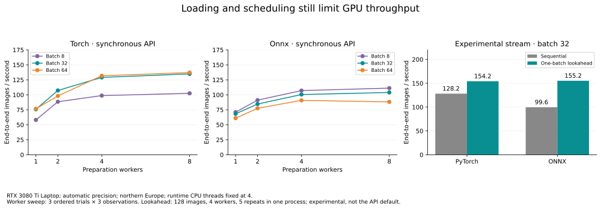

# Loading and scheduling after GPU acceleration

Historical diagnostic of the synchronous adapter after its first GPU acceleration.
Current request/streaming behavior and evidence are in the
[pipeline review](mambo-inference-pipeline-review.md).

**The plateau in this study was partly a loading/scheduling limit.** The synchronous
adapter waits for each batch's preparation before inference. Its preparation
threads do not intentionally run alongside that inference, but the timings include
both costs. A fixed worker count and a larger batch can leave preparation as a
similar per-image cost, even when prepared-input model execution is much faster.



The controlled sweep keeps runtime CPU threads at four and varies preparation
workers independently (1/2/4/8), with batches 8/32/64. It uses both backends on the
same 128-image bank, automatic GPU precision and northern Europe. Each cell has
three ordered trials (middle trial reversed), one warmup and three observations.
Trials share a loaded process per backend; these are diagnostic measurements,
not replacements for the three fresh-process release benchmark. This 128-image
bank differs from that benchmark's 32-image bank; compare interventions within
this study.

At **four preparation workers**, images/s are:

| Backend | Batch | Preparation alone | Prepared-input runtime | Complete synchronous API |
|---|---:|---:|---:|---:|
| PyTorch | 8 | 216.1 | 235.1 | 98.7 |
| PyTorch | 32 | 223.2 | 343.7 | 129.1 |
| PyTorch | 64 | 224.8 | 344.3 | 131.8 |
| ONNX | 8 | 210.8 | 205.3 | 107.1 |
| ONNX | 32 | 206.5 | 203.3 | 100.5 |
| ONNX | 64 | 170.3 | 208.3 | 90.8 |

Prepared-input timing includes transfer and completed CPU species scores, but no
loading or hierarchy reduction. These are separately timed boundaries, so their
medians are not additive. Both backends show a prepared-runtime plateau, but well
above the synchronous API's throughput. Increasing workers from four to eight
raises native batch-32 throughput from 129.1 to 134.9 images/s; ONNX rises from
100.5 to 104.0. Batch 64 does not deliver a further useful gain here.

A bounded **experimental one-batch lookahead**, with 128 images in four batches
of 32, increases throughput from **128.2 to 154.2 images/s** for native and
**99.6 to 155.2** for ONNX at four workers. It prepares the next batch while the
current batch runs, retaining at most two prepared batches. It preserves checked
top-1 predictions. Increasing to eight workers improves native slightly (157.7),
but lowers ONNX to 132.7: this is consistent with loading/inference contention, though scheduling and
laptop variability also affect this small comparison.
These lookahead numbers are five warmed repeats within one process per backend.

## Interpretation

Preparation workers and ONNX runtime threads are separate resource budgets. The
4–8 worker choices here reflect a warm-cache laptop workload, not a recommendation
for HPC or cold storage. The one-batch lookahead was an experiment at this stage;
a bounded production streaming API has since been implemented and qualified.
Use the [deployment guide](../deployment/README.md) for current controls and defaults.

## Reproduce

```sh
python -m dev.releases.mambo_v3.loading_scaling \
  --bundle /path/to/bundle --manifest /path/to/flemming-manifest.json \
  --root /path/to/flemming --backend torch --output /path/to/mambo-loading-scaling-torch
# Repeat sequentially with --backend onnx and mambo-loading-scaling-onnx.
python -m dev.releases.mambo_v3.loading_charts --root /path/to \
  --output /path/to/charts
```

Run without competing CPU/GPU work. [Compact measurements](assets/mambo-loading-scaling.json)
regenerate the chart through `loading_charts --data`; full observations, image
identities, source hashes and hardware snapshots remain in the raw reports.
