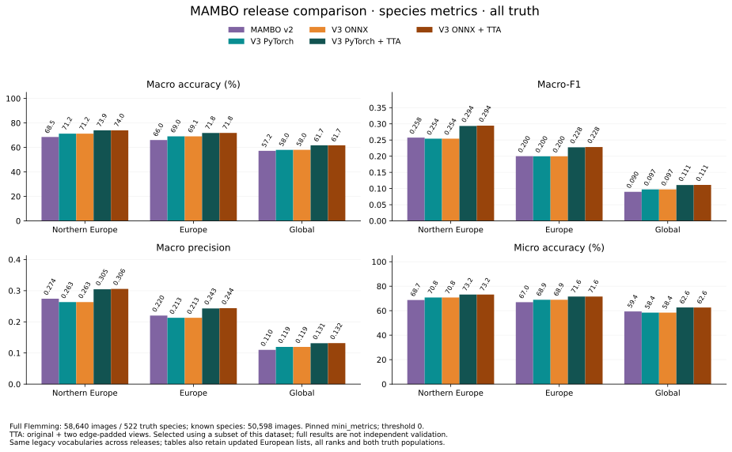
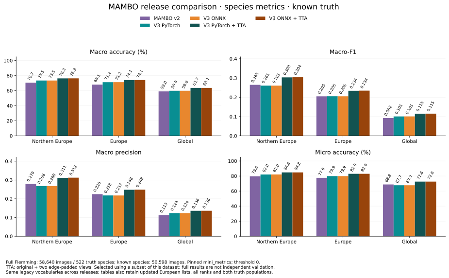
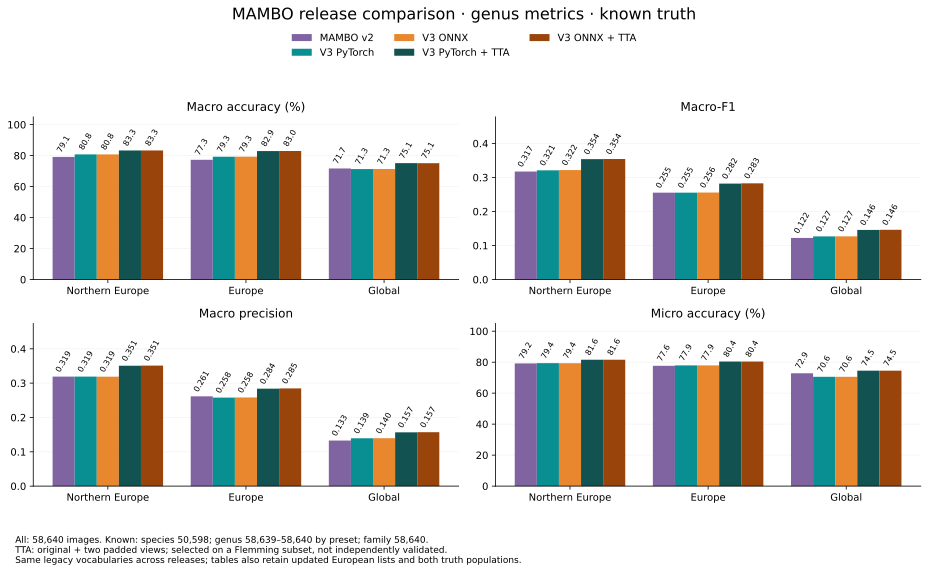
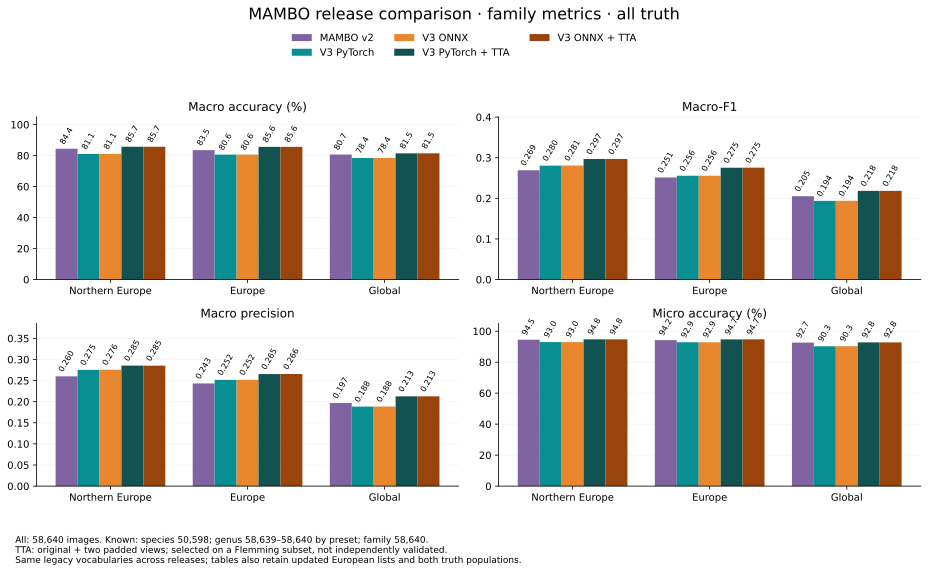

# Supplementary regional comparisons

Full regional tables and all/known-truth charts from the retained `mini_metrics`
evaluation. See the [main comparison](mambo-deployment-defaults.md) for the metric
policy, northern-Europe recommendation, regional summary and timing results.
These descriptive results use the same Flemming dataset used for TTA selection.

### Species

| Preset | Pipeline | Macro accuracy | Macro-F1 | Micro accuracy |
|---|---|---:|---:|---:|
| Northern Europe | MAMBO v2 | 68.52% | 0.2575 | 68.71% |
| Northern Europe | V3 PyTorch | 71.25% | 0.2543 | 70.78% |
| Northern Europe | V3 ONNX | 71.24% | 0.2543 | 70.78% |
| Northern Europe | V3 PyTorch + TTA | 73.95% | 0.2935 | 73.19% |
| Northern Europe | V3 ONNX + TTA | 73.98% | 0.2944 | 73.19% |
| Europe | MAMBO v2 | 66.04% | 0.2000 | 66.96% |
| Europe | V3 PyTorch | 69.05% | 0.1997 | 68.94% |
| Europe | V3 ONNX | 69.06% | 0.1997 | 68.95% |
| Europe | V3 PyTorch + TTA | 71.81% | 0.2276 | 71.57% |
| Europe | V3 ONNX + TTA | 71.85% | 0.2283 | 71.56% |
| Global | MAMBO v2 | 57.21% | 0.0899 | 59.36% |
| Global | V3 PyTorch | 58.01% | 0.0973 | 58.42% |
| Global | V3 ONNX | 58.03% | 0.0973 | 58.43% |
| Global | V3 PyTorch + TTA | 61.73% | 0.1110 | 62.63% |
| Global | V3 ONNX + TTA | 61.74% | 0.1112 | 62.61% |

Padded-scale TTA raises northern-Europe macro accuracy by **2.70 / 2.74 percentage
points** for PyTorch / ONNX, with macro-F1 rising to **0.2935 / 0.2944**. Species
macro accuracy, macro-F1 and micro accuracy exceed V2 for all three primary lists.
Genus and family results follow below; ordinary V3 loses family macro accuracy
against V2, while TTA recovers it.

Updated European presets (the same inference, different candidate lists):

| Preset | Backend | Ordinary macro accuracy / F1 | TTA macro accuracy / F1 |
|---|---|---:|---:|
| `north_europe_v3` | torch | 70.46% / 0.2368 | 73.10% / 0.2713 |
| `north_europe_v3` | onnx | 70.49% / 0.2365 | 73.12% / 0.2721 |
| `europe_v3` | torch | 68.86% / 0.1979 | 71.66% / 0.2253 |
| `europe_v3` | onnx | 68.88% / 0.1978 | 71.70% / 0.2261 |

### Genus

| Preset | Pipeline | Macro accuracy | Macro-F1 | Micro accuracy |
|---|---|---:|---:|---:|
| Northern Europe | MAMBO v2 | 78.90% | 0.3169 | 79.23% |
| Northern Europe | V3 PyTorch | 80.53% | 0.3204 | 79.37% |
| Northern Europe | V3 ONNX | 80.50% | 0.3212 | 79.36% |
| Northern Europe | V3 PyTorch + TTA | 83.04% | 0.3532 | 81.59% |
| Northern Europe | V3 ONNX + TTA | 83.04% | 0.3536 | 81.59% |
| Europe | MAMBO v2 | 77.29% | 0.2553 | 77.64% |
| Europe | V3 PyTorch | 79.28% | 0.2552 | 77.94% |
| Europe | V3 ONNX | 79.28% | 0.2557 | 77.94% |
| Europe | V3 PyTorch + TTA | 82.93% | 0.2820 | 80.40% |
| Europe | V3 ONNX + TTA | 82.97% | 0.2828 | 80.40% |
| Global | MAMBO v2 | 71.68% | 0.1221 | 72.85% |
| Global | V3 PyTorch | 71.30% | 0.1268 | 70.57% |
| Global | V3 ONNX | 71.33% | 0.1269 | 70.58% |
| Global | V3 PyTorch + TTA | 75.10% | 0.1457 | 74.52% |
| Global | V3 ONNX + TTA | 75.10% | 0.1461 | 74.52% |
| `north_europe_v3` | V3 PyTorch | 80.01% | 0.3041 | 78.88% |
| `north_europe_v3` | V3 ONNX | 79.98% | 0.3049 | 78.89% |
| `north_europe_v3` | V3 PyTorch + TTA | 82.78% | 0.3337 | 81.16% |
| `north_europe_v3` | V3 ONNX + TTA | 82.78% | 0.3341 | 81.16% |
| `europe_v3` | V3 PyTorch | 79.08% | 0.2528 | 77.79% |
| `europe_v3` | V3 ONNX | 79.08% | 0.2530 | 77.80% |
| `europe_v3` | V3 PyTorch + TTA | 82.68% | 0.2803 | 80.29% |
| `europe_v3` | V3 ONNX + TTA | 82.72% | 0.2809 | 80.29% |

Northern-Europe genus macro accuracy rises from **78.90% (V2)** to
**80.53% / 80.50% (ordinary V3)** and **83.04% / 83.04% (TTA)** for PyTorch / ONNX.
Known-genus results contain 58,639 or 58,640 images depending on the preset.

Known-truth genus metrics

### Family

| Preset | Pipeline | Macro accuracy | Macro-F1 | Micro accuracy |
|---|---|---:|---:|---:|
| Northern Europe | MAMBO v2 | 84.40% | 0.2691 | 94.49% |
| Northern Europe | V3 PyTorch | 81.05% | 0.2804 | 92.97% |
| Northern Europe | V3 ONNX | 81.06% | 0.2808 | 92.99% |
| Northern Europe | V3 PyTorch + TTA | 85.72% | 0.2967 | 94.77% |
| Northern Europe | V3 ONNX + TTA | 85.73% | 0.2967 | 94.77% |
| Europe | MAMBO v2 | 83.54% | 0.2513 | 94.23% |
| Europe | V3 PyTorch | 80.62% | 0.2556 | 92.85% |
| Europe | V3 ONNX | 80.63% | 0.2556 | 92.86% |
| Europe | V3 PyTorch + TTA | 85.63% | 0.2753 | 94.72% |
| Europe | V3 ONNX + TTA | 85.64% | 0.2755 | 94.73% |
| Global | MAMBO v2 | 80.70% | 0.2052 | 92.65% |
| Global | V3 PyTorch | 78.42% | 0.1936 | 90.30% |
| Global | V3 ONNX | 78.42% | 0.1938 | 90.31% |
| Global | V3 PyTorch + TTA | 81.46% | 0.2183 | 92.75% |
| Global | V3 ONNX + TTA | 81.45% | 0.2183 | 92.75% |
| `north_europe_v3` | V3 PyTorch | 80.66% | 0.2732 | 92.89% |
| `north_europe_v3` | V3 ONNX | 80.67% | 0.2733 | 92.89% |
| `north_europe_v3` | V3 PyTorch + TTA | 83.47% | 0.2778 | 94.69% |
| `north_europe_v3` | V3 ONNX + TTA | 83.47% | 0.2778 | 94.70% |
| `europe_v3` | V3 PyTorch | 80.48% | 0.2539 | 92.53% |
| `europe_v3` | V3 ONNX | 80.52% | 0.2541 | 92.55% |
| `europe_v3` | V3 PyTorch + TTA | 83.35% | 0.2729 | 94.50% |
| `europe_v3` | V3 ONNX + TTA | 83.37% | 0.2730 | 94.52% |

Family macro accuracy exposes a regression that species-only reporting missed:
northern Europe falls from **84.40% (V2)** to **81.05% / 81.06% (ordinary V3)**.
TTA recovers it to **85.72% / 85.73%**, while macro-F1 reaches **0.2967** for both
backends, versus **0.2691** for V2. All 58,640 images have known family truth.

Known-truth family metrics

The [complete metric table](assets/mambo-defaults-metrics.csv) retains macro
accuracy, precision, recall and F1, micro accuracy, Theil U and coverage, at all
three ranks and for both all/known truth. Known-only species results contain
50,598 images. Known genus contains 58,639–58,640 images by preset; known family
contains all 58,640. These are already-computed `mini_metrics` results; the added
rank views do not change the model runs, score extraction or threshold policy.
