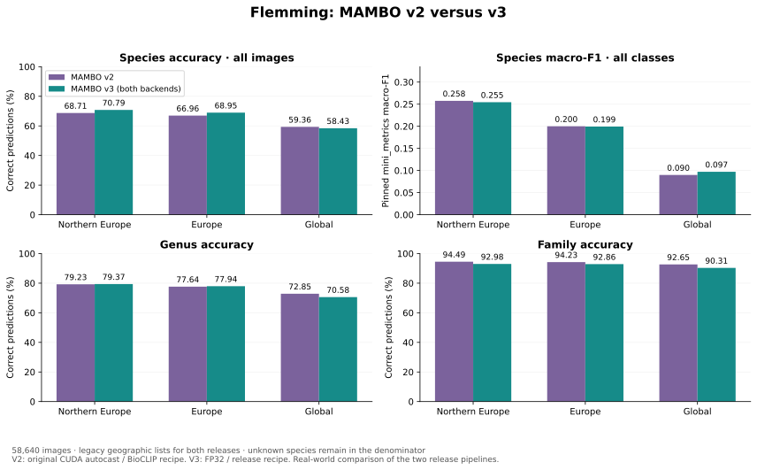
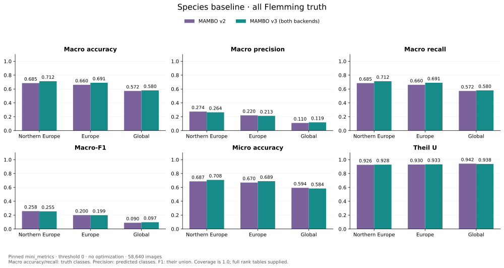
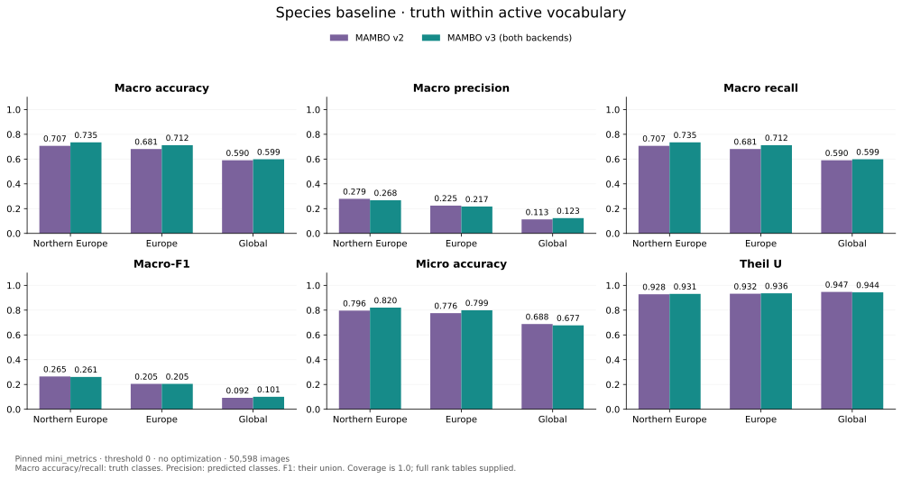
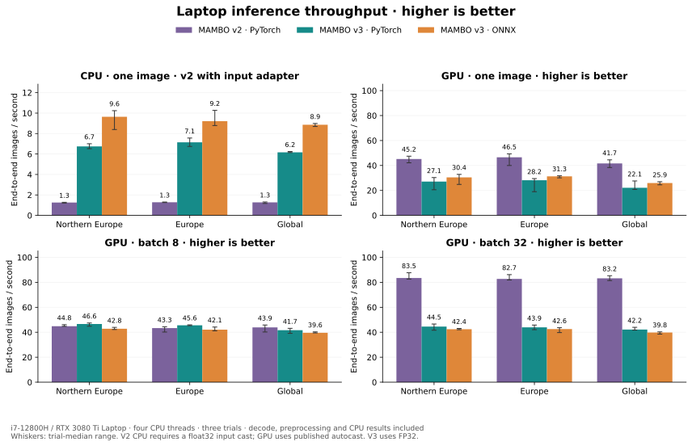
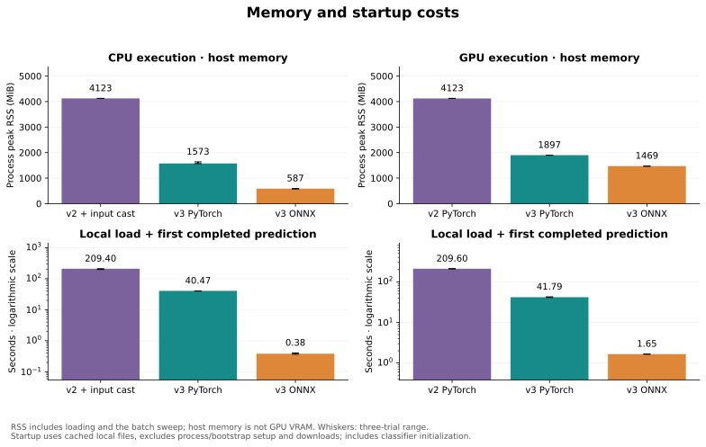
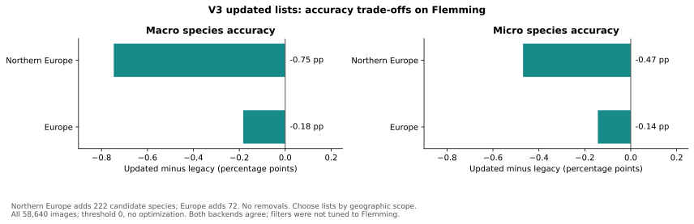

# MAMBO_v2 → v3: real-world deployment comparison

Historical comparison of V2 and the **original V3 FP32 pipeline** on the same
**58,640 Flemming images** and laptop. Northern Europe leads; Europe and global
show the effect of broader vocabularies. V3 includes PyTorch and standard ONNX.
The [acceleration study](mambo-accelerated-deployment.md) records subsequent
FP16/TF32 improvements; use the [deployment guide](../deployment/README.md#release-comparison)
for current adoption comparisons.

## Prediction quality

Macro metrics weight classes equally; micro accuracy weights images equally.
Northern-Europe macro accuracy improves while macro-F1 falls slightly. Global
macro accuracy improves despite lower micro accuracy: both views matter.

| Preset | v2 macro accuracy | v3 macro accuracy | v2 macro-F1 | v3 macro-F1 | v2 micro accuracy | v3 micro accuracy |
|---|---:|---:|---:|---:|---:|---:|
| Northern Europe | 68.52% | 71.24% | 0.2575 | 0.2545 | 68.71% | 70.79% |
| Europe | 66.04% | 69.06% | 0.2000 | 0.1993 | 66.96% | 68.95% |
| Global | 57.21% | 58.03% | 0.0899 | 0.0971 | 59.36% | 58.43% |

The [complete CSV](assets/mambo-release-metrics.csv) retains 48 rows / 336 scores:
macro accuracy, precision, recall and F1, micro accuracy, Theil U and coverage,
at all three ranks, both truth populations and including updated European lists.
The chart JSON also retains these complete results.

Both releases use identical legacy lists. Predictive metrics come from
`mini_metrics` commit `70cc69adc05362863439277048e06386c1f885e1`:

| Display | `metrics.json` source | Averaging and population |
|---|---|---|
| Lead species/genus/family accuracy | `all.accuracy["0"/"1"/"2"]` | Macro: equal weight per ground-truth class |
| Additional micro accuracy | `all.micro_accuracy[rank]` | Equal weight per image |
| Species macro-F1 | `all.f1["0"]` | Equal weight over the union of true and predicted species |
| Known-truth accuracy | `known.micro_accuracy[rank]` | Micro, restricted to truth in the active preset vocabulary |

Calls use `threshold=0`, `optimal=False`, `simple=True`, `hierarchical=False`;
the main chart uses `known_only=False`. No predictions are rejected or thresholds
fitted. Lists limit predictions, **not evaluation truth**: all 522 species remain,
including 8,042 images from 16 species outside the vocabulary. Known-only species
results retain 50,598 images from 506 species for each list; membership is checked
separately at genus and family level. Lists were not tuned to Flemming.

Macro precision averages predicted classes, recall averages truth classes, and
F1 averages their union. Predicted-only species therefore count in F1, whereas
classes with neither truth nor predictions do not: northern Europe has 1,221
active classes for V2 and 1,308 for V3, rather than just the 506 known species or
every preset species. At threshold zero, macro accuracy equals macro recall.
Theil U is an information-based association score, not accuracy.

## Inference speed

V2's CPU API failed with `expected scalar type BFloat16 but found Float`.
CPU bars use the value-preserving caller adaptation
`predictor.preproc = lambda x: original_preproc(x).float()`.
V2 GPU and quality measurements use the unchanged published path.

For northern Europe, the measured medians are:

| Pipeline | CPU, batch 1 | GPU, batch 1 | GPU, batch 8 | GPU, batch 32 |
|---|---:|---:|---:|---:|
| v2 PyTorch (CPU input cast) | 1.26 | 45.2 | 44.8 | 83.5 |
| v3 PyTorch | 6.74 | 27.1 | 46.6 | 44.5 |
| v3 ONNX | 9.64 | 30.4 | 42.8 | 42.4 |

All speeds are **images per second; higher is better**. V3 improves CPU throughput;
V2 leads GPU batches 1 and 32 in this historical FP32 comparison.

Timings include decoding, preparation, classification and completed CPU results.
Three fresh-process trials use the same seeded image bank; whiskers span trial
medians. Source data also retains CPU batch 8 and updated-list timings.

### Why v3 throughput plateaus

This historical adapter passed whole NCHW batches, up to 32, but decoded and
prepared images serially before inference. Three-trial northern-Europe timings
separate preparation from backend execution:

| Backend | Batch | CPU preparation, ms/batch | Prepared backend, ms/batch | End-to-end, images/s |
|---|---:|---:|---:|---:|
| PyTorch | 1 | 14.9 | 18.5 | 27.1 |
| PyTorch | 8 | 126.3 | 46.7 | 46.6 |
| PyTorch | 32 | 519.5 | 181.4 | 44.5 |
| ONNX | 1 | 16.6 | 13.4 | 30.4 |
| ONNX | 8 | 134.5 | 50.6 | 42.8 |
| ONNX | 32 | 559.4 | 180.6 | 42.4 |

These separately timed medians are not additive. The
[batch-scaling diagnosis](mambo-batch-scaling.md) retains shape/provider checks and
controlled interventions identifying non-contiguous, partly float64 interpolation
and strict FP32 execution. The linked acceleration study measures the resulting fixes.

## Memory and startup

Median peak host memory during CPU execution falls from **4,123 MiB** for adapted
v2 to **1,573 MiB** for v3 PyTorch and **587 MiB** for v3 ONNX. Loading plus the first
CPU prediction falls from **209 s** to **40.5 s** and **0.38 s**, respectively.

Native GPU allocator peaks during the batch sweep are:

| Pipeline | Peak allocated GPU memory | Peak reserved GPU memory |
|---|---:|---:|
| v2 PyTorch | 1,936 MiB | 2,072 MiB |
| v3 PyTorch | 865 MiB | 1,348 MiB |
| v3 ONNX | Not measured comparably | Not measured comparably |

GPU counters exclude allocations outside PyTorch; ONNX snapshots are not comparable
allocator peaks. Host RSS covers loading and the full sweep (CPU batches 1/8;
GPU also 32), not GPU VRAM. Startup uses cached assets and includes construction,
classifier initialization and the first completed prediction, excluding process
launch and explicit runtime setup. Reuse the predictor to amortize this cost.

## Updated v3 European lists

Updated northern Europe adds 222 species and Europe adds 72, with no removals.
Their macro accuracy becomes **70.49% / 68.88%**, micro accuracy **70.32% / 68.81%**
and macro-F1 **0.2367 / 0.1975**, versus the legacy values above. Broader occurrence
eligibility costs some measured Flemming performance. The
[preset catalogue](model-presets.md) defines geographic scope and construction.

## Reproduce and interpret

The [comparison workflow](../dev/releases/mambo_v3/release-comparison.md) pins the
historical source, head weights, external BioCLIP-2 backbone and metric revision.
[Chart source data](assets/mambo-release-comparison.json) contains compact metrics,
timing summaries and evidence hashes, and can regenerate the figures without
image data. Raw predictions and timing observations remain under `local-evidence/`.

V2 uses its original release API, including a 512-pixel initial resize, BioCLIP
preprocessing to 224 pixels and CUDA float16 autocast. V3 uses its 384-pixel release
recipe and FP32. These choices are part of the real-world pipeline comparison.
The v2 historical code is unchanged, running with the documented contemporary
comparison environment. Both releases use the same PyTorch/CUDA installation;
ONNX Runtime is 1.30.0. Hardware is an i7-12800H / RTX 3080 Ti Laptop GPU (16 GB),
on AC power under Linux/WSL2, with four CPU threads and TF32 disabled.

The earlier [v3 qualification report](mambo-v3-evaluation.md) covers embedding-mode
consistency, additional timing detail and installed-package checks.
[In-domain comparison](mambo-indomain-evidence.md) has since completed with the
original test split. [Final qualification](../dev/releases/mambo_v3/final-qualification.md)
owns current provenance, notices and platform limits; this historical comparison
does not certify final release packages.
