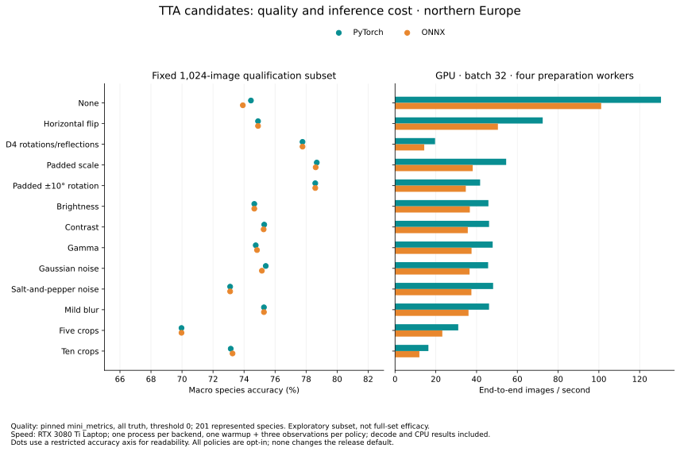

# Optional outer test-time augmentation

TTA is an opt-in deployment feature shared by PyTorch and ONNX. View generation
operates on decoded images **before** the ordinary, unchanged preprocessing recipe.
It does not depend on backbone internals, ONNX graph changes, an intermediate crop
size or the selected class list.

| Profile | Views | Spatial policy |
|---|---:|---|
| `none` | 1 | Ordinary single-view path; default |
| `hflip` | 2 | Original and horizontal reflection |
| `five_crop` | 5 | Original and four corner crops, each 90% of original height/width |
| `ten_crop` | 10 | Five-crop views and their horizontal reflections |
| `d4` | 8 | Rotations of 0/90/180/270 degrees and their horizontal reflections |
| `light_noise` | 3 | Original plus two independently seeded 1% salt-and-pepper views |

`SaltAndPepper(proportion=0.01, seed=0)` is also available as a public transform.
It uses one RGB-shared black/white pixel mask and an image-keyed seed, so built-in
noise is reproducible across batch sizes and preparation worker counts. It operates
on the decoded source before normal preprocessing; this is not a claim of exact
training-pipeline RNG or noise-placement equivalence.

These are convenience profiles, not restrictions on the interface. `TTA` accepts
an ordered finite sequence of arbitrary callables. `View` implements fractional
crops, quarter-turn rotations and reflection; arbitrary rotations, scales, color
transforms or other policies can be supplied by a caller. Each callable receives
its own uint8 RGB CHW copy of the decoded image. It can return a CHW array or PIL
image accepted by the existing preprocessing function. Random custom transforms
are the caller's responsibility; built-ins are deterministic. Give custom policies
a descriptive name for output provenance.

For each image batch, the outer layer decodes once, prepares one view at a time,
and invokes the ordinary runtime. Runtime batches never grow by the view count.
It retains the decoded batch and the current prepared view, not all prepared views.
Host memory also depends on original image dimensions; use smaller batches for
large source images. Species logits are averaged in FP32, then the ordinary class mask, hierarchy and
confidence normalization are applied. This is **logit averaging**, not voting or
averaging already-normalized probabilities. Preset and custom-list semantics stay
aligned. Output metadata records the policy name and view count.

When requested, each view uses the normal embedding path. Its embeddings are
averaged in FP32 and normalized to unit length; a nonfinite or near-zero mean
raises an error. Averaged embeddings have not been qualified for downstream
retrieval/clustering. The default single-view representation is unchanged.

## Qualification

Both automatic GPU backends passed a fixed, seeded **1,024-image / 201-species**
Flemming qualification with all six built-in profiles and all five release evaluation
presets. Metrics use pinned `mini_metrics` at the same revision and threshold-zero
policy as the full release comparison. Species results include all 1,024 images;
880 have truth inside the northern-Europe vocabulary. These are **subset results**,
not directly comparable to the full-set scores or evidence of a universal gain.

Northern Europe, all truth:

| Profile | PyTorch macro accuracy | ONNX macro accuracy | PyTorch macro-F1 | ONNX macro-F1 |
|---|---:|---:|---:|---:|
| None | 74.44% | 73.92% | 0.4715 | 0.4693 |
| Horizontal flip | 74.90% | 74.90% | 0.4878 | 0.4863 |
| Five crops | 69.97% | 69.97% | 0.4137 | 0.4137 |
| Ten crops | 73.14% | 73.26% | 0.4472 | 0.4478 |
| D4 rotations/reflections | 77.77% | 77.77% | 0.5137 | 0.5137 |
| Light salt-and-pepper noise | 73.10% | 73.10% | 0.4582 | 0.4582 |

D4 improves native macro accuracy by 3.33 percentage points in this subset;
crop profiles are worse than single-view inference. Cropping can discard useful
parts of a specimen or its context. These profiles were defined before this
comparison; none is selected as a new default. Small per-image changes can have
visible macro effects when species have very little evaluation support.

The [compact metrics](assets/mambo-tta-comparison.json) retain all/known-truth
macro and micro metrics at species/genus/family level for every profile, backend
and evaluated list. Full-data TTA efficacy, in-domain behavior and downstream
embedding usefulness remain unmeasured. Both backends passed finite-score checks,
and public prediction/embedding agreement, custom-list and unit-embedding checks
on the first eight qualification images for every profile. The installed ONNX-only
wheel passed ten-crop API/CLI inference offline against a relocated read-only bundle.



The [chart data](assets/mambo-tta-tradeoffs.json) retain timing observations.
Throughput includes image decoding, preparation, inference and CPU results on the
RTX 3080 Ti Laptop GPU, batch 32, four preparation workers. These are diagnostic
measurements: one process per backend, one warmup and three observations per policy,
using the same 32-image bank. They are not the full release benchmark.

| Policy | PyTorch images/s | ONNX images/s |
|---|---:|---:|
| `none` | 130.5 | 101.1 |
| `hflip` | 72.4 | 50.5 |
| `d4` | 19.6 | 14.3 |
| `padded_scale` | 54.5 | 38.1 |
| `padded_rotation` | 41.7 | 34.7 |
| `light_noise` | 48.1 | 37.5 |

Unit tests cover source-view isolation for mutating custom transforms, transformations
before ordinary preprocessing, bounded calls and ordering, both backend dispatches,
logit aggregation before masking, prediction/embedding consistency, normalized mean
embeddings and explicit rejection of undefined means. Existing preprocessing hashes
remain unchanged. The release code adds no dependency or shared-core modification.

## Reproduce

```sh
python -m dev.releases.mambo_v3.qualify_tta \
  --bundle /path/to/bundle --manifest /path/to/flemming-manifest.json \
  --root /path/to/flemming --backend torch --count 1024 --output /path/to/new-tta-torch
# Repeat with --backend onnx and another output directory.
/path/to/pinned-metrics-env/bin/python -m dev.releases.mambo_v3.metrics \
  --source /path/to/new-tta-torch/ten_crop/north_europe/mini_metric.csv \
  --output /path/to/new-tta-torch/ten_crop/north_europe/metrics.json
```

Use `qualify_tta --profiles brightness contrast gamma gaussian_noise padded_scale
mild_blur padded_rotation` for the seven additional candidates, with another output
directory. `tta_report --root /path/to/qualification-parent` computes every retained
metric through the pinned package; `--extra-root` combines disjoint profile runs
after checking identical sample identities.

For a cost sweep, run `qualify_tta --timing-only` separately for each backend,
with `--profiles none hflip five_crop ten_crop d4 light_noise brightness contrast
gamma gaussian_noise padded_scale mild_blur padded_rotation`, using output folders
`mambo-tta-timing-torch` and `mambo-tta-timing-onnx` under one parent directory.
Run sequentially without competing CPU/GPU work. Then render quality and cost:

```sh
python -m dev.releases.mambo_v3.tta_charts \
  --quality /path/to/combined-tta-metrics.json --root /path/to/timing-parent \
  --output /path/to/charts
# Or regenerate solely from the retained compact data:
python -m dev.releases.mambo_v3.tta_charts \
  --data docs/assets/mambo-tta-tradeoffs.json --output /path/to/charts
```

The collector also supports `evaluate collect --tta PROFILE` for a full run. Its
`tta_prepare_infer_seconds` combines preparation and inference; it is a collection
timer, not an isolated speed benchmark. Use fresh outputs and preserve original
splits, fixed lists and the pinned metric policy. Do not tune a policy on Flemming
and then report its selection-set score as an independent validation.

## Literature-informed candidate space

The policy space should reflect plausible nuisance variation in specimen images,
not where it is easiest to insert an operation in the model pipeline. Preserving
the visible specimen is a useful design preference for this task. It is not a
claim that every extent-preserving transform improves classification.

- [Greedy Policy Search (UAI 2020)](https://proceedings.mlr.press/v124/lyzhov20a.html)
  evaluates diverse learned TTA policies on image classifiers, including
  EfficientNets. It supports considering broader policies and selecting their
  composition on separate validation data, rather than assuming a crop/flip list
  is sufficient. This release does not implement policy learning.
- [TTAch](https://github.com/qubvel/ttach) demonstrates the community pattern of
  wrapping classification with independently composed rotations, reflections,
  scales and intensity changes. The release uses that separation of concerns
  without adding a PyTorch-only TTA dependency to the portable runtime.
- [Cohen and Giryes (WACV 2024)](https://openaccess.thecvf.com/content/WACV2024/html/Cohen_Simple_Post-Training_Robustness_Using_Test_Time_Augmentations_and_Random_Forest_WACV_2024_paper.html)
  explores color, blur, noise and geometric TTA for adversarial robustness with
  a learned aggregator. Its [supplement](https://openaccess.thecvf.com/content/WACV2024/supplemental/Cohen_Simple_Post-Training_Robustness_WACV_2024_supplemental.pdf)
  specifies brightness, contrast, gamma, blur and Gaussian noise. These motivate
  candidate families, not a moth-specific efficacy claim or a reproduction of
  that learned method.
- [PlantCLEF 2019](https://ceur-ws.org/Vol-2380/paper_247.pdf) documents multi-scale
  mirrored test views in species recognition. It provides relevant precedent;
  its cropped views do not establish that cropping is appropriate for these moth
  photographs.
- [Better Aggregation in TTA (ICCV 2021)](https://openaccess.thecvf.com/content/ICCV2021/html/Shanmugam_Better_Aggregation_in_Test-Time_Augmentation_ICCV_2021_paper.html)
  studies aggregation and changes in individual predictions. Aggregation itself
  is therefore an experimental choice; this release documents its fixed logit
  mean and does not claim it is optimal.

The following additional **three-view candidates** use the original view plus two
perturbations, through ordinary public `TTA` callables in
[tta_candidates.py](../dev/releases/mambo_v3/tta_candidates.py):

| Candidate | Two additional views | Rationale for this task |
|---|---|---|
| Brightness | Factors 0.9 / 1.1 | Exposure variation; same spatial region |
| Contrast | Factors 0.9 / 1.1 | Illumination/contrast variation without moving the specimen |
| Gamma | Exponents 0.9 / 1.1 | Moderate nonlinear tone changes |
| Gaussian noise | Two image-keyed seeds; sigma 0.005 in [0,1] | Sensor-like perturbation; unchanged extent |
| Mild blur | Gaussian radii 0.25 / 0.5 source pixels | Weak sharpness variation; may suppress fine diagnostic texture |
| Padded scale | Edge padding of 8% / 15% on each side | Smaller specimen scale without cutting away source regions |
| Padded rotation | −10 / +10 degrees; expanded canvas and 8% padding | Small orientation changes without cutting off rotated corners |

These magnitudes are deliberately specified starting candidates, not claimed
optima. The small-rotation policy also adds padding; its result alone cannot
isolate rotation from framing/scale effects. Padding changes border statistics and apparent scale; color and noise can
change diagnostic detail even when they preserve image extent. The normal model
recipe still applies to every view. The added padding is large enough to retain
the expanded source canvas through that recipe's center crop. Unlike quarter
turns, arbitrary rotations require interpolation.

All seven candidates passed the same 1,024-image qualification through both
backends, including the public custom-list and embedding checks. Northern Europe,
all truth, using the same pinned mini_metrics policy:

| Candidate | PyTorch macro accuracy | ONNX macro accuracy | PyTorch macro-F1 | ONNX macro-F1 |
|---|---:|---:|---:|---:|
| Brightness | 74.66% | 74.66% | 0.4732 | 0.4732 |
| Contrast | 75.30% | 75.26% | 0.4821 | 0.4820 |
| Gamma | 74.75% | 74.83% | 0.4750 | 0.4769 |
| Gaussian Noise | 75.40% | 75.15% | 0.4877 | 0.4852 |
| Padded Scale | 78.69% | 78.62% | 0.5328 | 0.5307 |
| Mild Blur | 75.28% | 75.28% | 0.4787 | 0.4787 |
| Padded Rotation | 78.59% | 78.59% | 0.5509 | 0.5509 |

These results favor padded scale/rotation views in this subset, with smaller gains
from several photometric/noise policies. They do not establish a general ranking
or separate padding from rotation effects. Every tested result is retained,
including the worse crop and salt-and-pepper profiles; none is silently selected
as a default. All 13 policies were tested on the same fixed subset. The additional
candidates are reproducible public-interface examples, not extra CLI profiles.

Keep D4 and other whole-image policies prominent in consumer documentation; retain
crop profiles as optional experimental comparisons. Strong hue changes, aggressive
blur, erasing/Cutout and unbounded Cartesian products are lower-priority candidates
here because they alter diagnostic colors/details or rapidly multiply inference
cost. This priority is a task-specific inference from the literature and current
measurements, not a universal TTA ranking. A compact mixed policy can be tested
next on independent validation data; full Flemming and UCloud evaluation must
remain separate from policy selection.

A portable custom policy can use existing Pillow functionality directly:

```python
from PIL import Image, ImageEnhance
from mambo_deploy import Predictor, TTA, View


def dimmer(chw):
    image = Image.fromarray(chw.transpose(1, 2, 0))
    return ImageEnhance.Brightness(image).enhance(0.9)


policy = TTA((View(), dimmer), name="original-plus-dimmer")
predictor = Predictor(bundle, backend="onnx", tta=policy)
```

This example illustrates composition; its two-view combination is not the
three-view brightness policy measured above. The measured policies can be reproduced
from the linked candidate definitions without depending on any training module.
