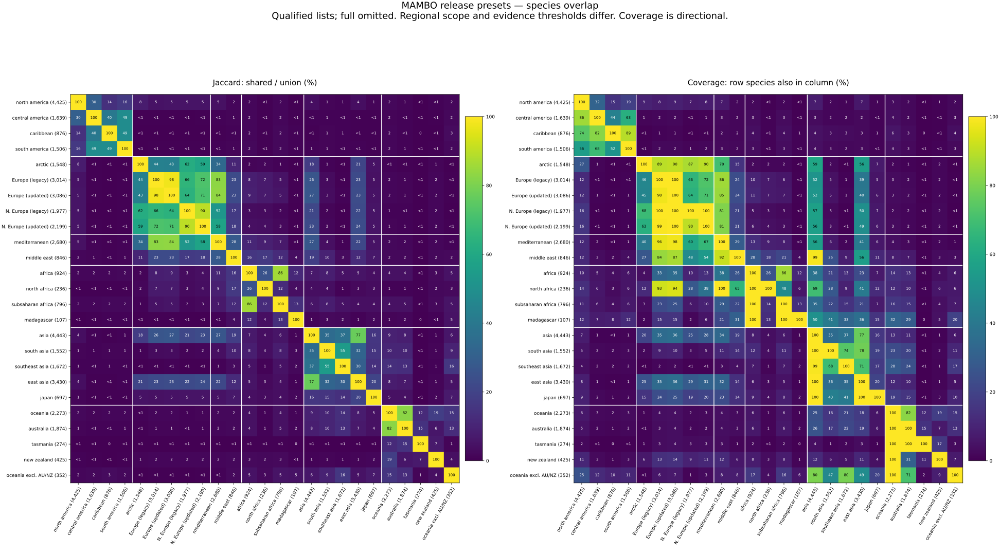

# Model preset scope

Generated release catalogue: edit `dev/releases/mambo_v3/preset-definitions.toml`, then use the build command below.

These overlapping deployment presets aim to avoid most geographically nonsensical predictions while allowing species that **can be found** in a region. They do not describe native or natural distributions, or where species should occur. Recorded introduced species, migrants and vagrants are eligible: no native-status or establishment filter is applied. Exclusion is not evidence that a species cannot occur there. Country codes are ISO alpha-2 metadata values.

Each geographic preset applies the minimum row count shown below. Counts use all existing splits, including held-out rows, without further deduplication. Each row counts once even if it matches both a country and a continent predicate. Full uses all model species without a regional threshold. Lists retain the model's species order.

**Provisional qualification:** new presets require at least 3 regional rows and at least 25 global rows for a species. These inclusive thresholds are a working proposal, pending the final release decision. They reduce weak occurrence evidence but do not prove that records are independent or correctly geolocated: multiple images may belong to one observation. The global count measures available examples, not demonstrated model quality. Legacy presets retain their historical >25 regional-row rule with no new global gate.

In this pinned snapshot every model species has at least 50 global rows; 0 model species fall below the proposed global minimum of 25. Before finalizing qualification, decide whether regional evidence should count distinct GBIF observations instead of rows, and assess the effect on rare-species coverage. The present rule is reproducible, not a claim of ecological certainty.

Europe and northern Europe preserve MAMBO_v2 membership. Parenthesized countries in northern Europe's scope have ambiguous historical inclusion and do not change its membership. The other presets are new release definitions. These are release assets; adapter/API discovery integration and preset-specific inference qualification are still pending.

## Presets

| ID | Species | Minimum regional rows | Minimum global rows | Selected rows | Geographic scope |
| --- | ---: | ---: | ---: | ---: | --- |
| `full` | 12,632 | None | None | — | All species in the pinned model. |
| `europe` | 3,014 | 26 | None | 2,079,617 | Records assigned EUROPE by the metadata, including European-labelled portions of transcontinental countries. |
| `north_europe` | 1,977 | 26 | None | 768,497 | Germany, Denmark, Estonia, Finland, Lithuania, Latvia, Netherlands, Norway, Poland, Sweden (Ireland, Iceland, Åland, Faroe Islands, Guernsey, Isle of Man, Jersey, Svalbard/Jan Mayen: ambiguous historical inclusion; adding any or all leaves the species list unchanged). |
| `australia` | 1,874 | 3 | 25 | 465,726 | All Australian records, including Tasmania and other territories recorded under AU; not all Oceania. |
| `tasmania` | 274 | 3 | 25 | 4,457 | Australian records explicitly assigned stateProvince Tasmania. Species recorded there, not only endemic species; blank/other state values are excluded. |
| `north_america` | 4,425 | 3 | 25 | 2,300,391 | Canada, United States, Mexico, Greenland, Bermuda, Saint Pierre and Miquelon. Whole countries, including US records outside the continental mainland. |
| `central_america` | 1,639 | 3 | 25 | 210,173 | Mexico, Belize, Guatemala, Honduras, El Salvador, Nicaragua, Costa Rica, Panama. Mexico deliberately overlaps North America. |
| `south_america` | 1,506 | 3 | 25 | 257,026 | All SOUTH_AMERICA records or records from Argentina, Bolivia, Brazil, Chile, Colombia, Ecuador, Falklands, French Guiana, Guyana, Paraguay, Peru, Suriname, Uruguay, Venezuela, Costa Rica or Panama. Costa Rica and Panama deliberately overlap Central America. |
| `caribbean` | 876 | 3 | 25 | 28,652 | Caribbean islands and territories, Bahamas, Bermuda, Belize and the Guianas (Guyana, Suriname, French Guiana). Does not include every mainland country with a Caribbean coast. |
| `south_asia` | 1,552 | 3 | 25 | 177,926 | Afghanistan, Bangladesh, Bhutan, India, Maldives, Nepal, Pakistan, Sri Lanka, Myanmar and Iran; deliberately broad western/eastern overlap. |
| `asia` | 4,981 | 3 | 25 | 1,031,247 | All ASIA records plus all records from the listed Asian countries and territories, including Russia, Turkey, Georgia, Armenia, Azerbaijan in full. Includes their European-labelled records and records with blank continent. Cyprus is excluded even when its continent is ASIA. |
| `japan` | 697 | 3 | 25 | 30,076 | All records assigned countryCode JP, including islands. |
| `africa` | 924 | 3 | 25 | 149,267 | All AFRICA records plus the listed African countries and island territories. AFRICA-labelled records from transcontinental/overseas countries remain included. |
| `north_africa` | 236 | 3 | 25 | 4,393 | Algeria, Egypt, Libya, Morocco, Tunisia, Western Sahara, Sudan and Mauritania. Sudan and Mauritania deliberately overlap the broad sub-Saharan preset. |
| `subsaharan_africa` | 796 | 3 | 25 | 144,918 | Broad African selection excluding Algeria, Egypt, Libya, Morocco, Tunisia and Western Sahara. Includes Sudan, Mauritania, Mali, Niger, Chad, the Horn, Madagascar and island territories; this is not a Sahara boundary polygon. |
| `madagascar` | 107 | 3 | 25 | 2,584 | All records assigned countryCode MG. Species recorded in Madagascar, not only endemic species; neighbouring island countries/territories are excluded. |
| `mediterranean` | 2,680 | 3 | 25 | 660,065 | Whole Mediterranean coastal countries/territories plus Portugal, Andorra, San Marino, Vatican City, North Macedonia, Bulgaria, Serbia and Jordan. Includes inland and overseas records of selected countries, not only Mediterranean climate zones. |
| `arctic` | 4,333 | 3 | 25 | 871,155 | Canada, Alaska (US records only when stateProvince is Alaska), Greenland, Iceland, Faroe Islands, Norway, Svalbard/Jan Mayen, Sweden, Finland, Åland and Russia. Other countries remain whole-country proxies including southern records; this is not an Arctic Circle or tundra filter. US records with blank state are excluded. |
| `oceania` | 2,273 | 3 | 25 | 584,477 | All OCEANIA records plus Australia, New Zealand, Papua New Guinea and the listed Pacific countries/territories. Australia and Tasmania intentionally overlap. |
| `new_zealand` | 425 | 3 | 25 | 110,030 | All records assigned countryCode NZ, including islands recorded under NZ. Separately coded Cook Islands, Niue and Tokelau remain in the other-Oceania preset. |
| `oceania_excluding_australia_nz` | 352 | 3 | 25 | 8,721 | The Oceania metadata selection with all AU and NZ records excluded, even when continent is OCEANIA. Species shared with Australia or New Zealand remain eligible if they qualify from records elsewhere in Oceania; this is not subtraction of their species lists. |
| `southeast_asia` | 1,672 | 3 | 25 | 172,424 | Brunei, Cambodia, Indonesia, Laos, Malaysia, Myanmar, Philippines, Singapore, Thailand, Timor-Leste, Vietnam and Papua New Guinea; whole-island-region overlap with Oceania is intentional. |
| `east_asia` | 4,123 | 3 | 25 | 659,767 | China, Hong Kong, Macao, Taiwan, Japan, North Korea, South Korea, Mongolia and Russia. All Russia is included because this preset uses whole-country filters. |
| `middle_east` | 846 | 3 | 25 | 24,805 | Turkey, Cyprus, Syria, Lebanon, Israel, Palestine, Jordan, Iraq, Iran, Kuwait, Saudi Arabia, Bahrain, Qatar, UAE, Oman, Yemen, Egypt, Armenia, Azerbaijan, Georgia, Afghanistan and Pakistan. Deliberate overlap with Mediterranean, Africa and South Asia. |

## Species overlap



Left: shared species divided by the union (Jaccard similarity). Right: the percentage of each row's species also present in each column. Coverage reveals containment that Jaccard can hide for small lists. These compare the qualified species lists, not geographic areas or prediction accuracy. Full is omitted because it contains every preset. Labels show list sizes; both panels use percentages.

Rebuild the figure and exact shared-count/percentage table with `.venv/bin/python -m dev.releases.mambo_v3.plot_overlap`. The companion [pairwise table](assets/preset-overlap.tsv) includes exact counts.

## Exact metadata filters

- **europe** (Europe (legacy)): `continent` in `EUROPE`.
- **north_europe** (Northern Europe (legacy)): `countryCode` in `DE, DK, EE, FI, LT, LV, NL, NO, PL, SE`.
- **australia** (Australia including Tasmania): `countryCode` in `AU`.
- **tasmania** (Tasmania only): (`countryCode` in `AU`) AND `stateProvince` in `Tasmania`.
- **north_america** (North America): `countryCode` in `CA, US, MX, GL, BM, PM`.
- **central_america** (Central America): `countryCode` in `MX, BZ, GT, HN, SV, NI, CR, PA`.
- **south_america** (South America): `continent` in `SOUTH_AMERICA` OR `countryCode` in `AR, BO, BR, CL, CO, EC, FK, GF, GY, PY, PE, SR, UY, VE, CR, PA`.
- **caribbean** (Caribbean): `countryCode` in `AG, AI, AW, BB, BL, BQ, BS, CU, CW, DM, DO, GD, GP, HT, JM, KN, KY, LC, MF, MQ, MS, PR, SX, TC, TT, VC, VG, VI, BM, BZ, GY, SR, GF`.
- **south_asia** (South Asia): `countryCode` in `AF, BD, BT, IN, MV, NP, PK, LK, MM, IR`.
- **asia** (Asia): (`continent` in `ASIA` OR `countryCode` in `AF, AM, AZ, BH, BD, BT, BN, KH, CN, GE, HK, IN, ID, IR, IQ, IL, JP, JO, KZ, KP, KR, KW, KG, LA, LB, MO, MY, MV, MN, MM, NP, OM, PK, PS, PH, QA, RU, SA, SG, LK, SY, TW, TJ, TH, TL, TR, TM, AE, UZ, VN, YE`) AND country NOT in `CY`.
- **japan** (Japan): `countryCode` in `JP`.
- **africa** (Africa): `continent` in `AFRICA` OR `countryCode` in `DZ, AO, BJ, BW, BF, BI, CV, CM, CF, TD, KM, CG, CD, CI, DJ, EG, GQ, ER, SZ, ET, GA, GM, GH, GN, GW, KE, LS, LR, LY, MG, MW, ML, MR, MU, YT, MA, MZ, NA, NE, NG, RE, RW, SH, ST, SN, SC, SL, SO, ZA, SS, SD, TZ, TG, TN, UG, EH, ZM, ZW`.
- **north_africa** (Northern Africa (broad)): `countryCode` in `DZ, EG, LY, MA, TN, EH, SD, MR`.
- **subsaharan_africa** (Sub-Saharan Africa (broad)): (`continent` in `AFRICA` OR `countryCode` in `AO, BJ, BW, BF, BI, CV, CM, CF, TD, KM, CG, CD, CI, DJ, GQ, ER, SZ, ET, GA, GM, GH, GN, GW, KE, LS, LR, MG, MW, ML, MR, MU, YT, MZ, NA, NE, NG, RE, RW, SH, ST, SN, SC, SL, SO, ZA, SS, SD, TZ, TG, UG, ZM, ZW`) AND country NOT in `DZ, EG, LY, MA, TN, EH`.
- **madagascar** (Madagascar only): `countryCode` in `MG`.
- **mediterranean** (Mediterranean (broad)): `countryCode` in `AL, DZ, BA, HR, CY, EG, FR, GR, IL, IT, LB, LY, MT, MC, ME, MA, PS, SI, ES, SY, TN, TR, PT, GI, AD, SM, VA, MK, BG, RS, JO`.
- **arctic** (Arctic / broad northern-country scope): `countryCode` in `CA, US, GL, IS, FO, NO, SJ, SE, FI, AX, RU`; `US` records additionally require `stateProvince` in `Alaska`.
- **oceania** (Oceania): `continent` in `OCEANIA` OR `countryCode` in `AU, NZ, PG, FJ, SB, VU, NC, PF, WS, AS, TO, TV, KI, NR, FM, MH, PW, GU, MP, CK, NU, TK, WF, PN, NF`.
- **new_zealand** (New Zealand): `countryCode` in `NZ`.
- **oceania_excluding_australia_nz** (Oceania excluding Australia and New Zealand): (`continent` in `OCEANIA` OR `countryCode` in `AU, NZ, PG, FJ, SB, VU, NC, PF, WS, AS, TO, TV, KI, NR, FM, MH, PW, GU, MP, CK, NU, TK, WF, PN, NF`) AND country NOT in `AU, NZ`.
- **southeast_asia** (Southeast Asia): `countryCode` in `BN, KH, ID, LA, MY, MM, PH, SG, TH, TL, VN, PG`.
- **east_asia** (East Asia): `countryCode` in `CN, HK, MO, TW, JP, KP, KR, MN, RU`.
- **middle_east** (Middle East): `countryCode` in `TR, CY, SY, LB, IL, PS, JO, IQ, IR, KW, SA, BH, QA, AE, OM, YE, EG, AM, AZ, GE, AF, PK`.

## Interpretation and reproducibility

Mexico belongs to North and Central America; Costa Rica and Panama belong to Central and South America. Australia includes Tasmania; Tasmania-only uses the explicit state field and does not mean endemic-only. Arctic uses Alaska for US records; other selected countries remain broad proxies including southern records. Regional restrictions change score normalization; excluded truth labels must remain visible in evaluation.

Blank geographic fields match no predicate unless another selected field matches. The Tasmania preset excludes Australian records with blank or different state values. Overlapping presets are expected; membership in one does not exclude another.

Run from the repository root with the existing PyArrow environment and the previously downloaded model manifest:

```sh
.venv/bin/python -m dev.releases.mambo_v3.build_presets \
  examples/global_lepi/0032836-250426092105405_processing_metadata_postprocessed_quality_filtered.parquet \
  --evidence-root local-evidence/mambo-v3
```

The default checks committed assets, hashes, counts and this catalogue against fresh reconstruction. Use `--write` after an intentional definition update to regenerate them. Legacy preset hashes must remain unchanged. Published preset membership changes require a new release/revision and an added/removed-ID report.

[Machine-readable definitions](../dev/releases/mambo_v3/preset-definitions.toml), [generated hashes and counts](../dev/releases/mambo_v3/preset-manifest.toml), [source provenance](../dev/releases/mambo_v3/construction.toml), [legacy reconstruction details](../dev/releases/mambo_v3/README.md#regional-scope-and-construction).
